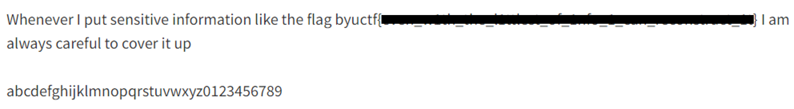

# BYUCTF 2022 - Reconstruct

## 题目简述

图片中的 flag 主体被黑条遮住，只留下部分字母的底端、下伸部和边缘。题目同时给出完整 flag 的 MD5 `63b1424fa6fe8aa81d9ce4b5637f7acd`，用于在提交前验证人工重建结果。



## 解题过程

放大图片并逐字符记录可见特征：是否有下伸笔画、底部弧线、竖线数量以及字符宽度。图片下方还给出同字体的字符参考，可把每个残片与候选字母、数字或下划线进行比对。已知前缀 `byuctf{` 和自然语言结构能进一步约束歧义位置。

逐段重建出的候选为：

```text
byuctf{even_w1th_the_l1ttlest_of_1nfo_1_can_reconstruct_1t}
```

对完整字符串计算 MD5：

```bash
printf %s 'byuctf{even_w1th_the_l1ttlest_of_1nfo_1_can_reconstruct_1t}' | md5sum
```

结果与题面给出的 `63b1424fa6fe8aa81d9ce4b5637f7acd` 一致，排除了 `i/1`、缺下划线等视觉歧义。

## 方法总结

遮挡并未消除全部字形信息。先用可见几何特征缩小候选，再用已知格式和语义重建，最后以完整字符串哈希做确定性验收；哈希在这里是校验值，而不是要破解的目标。
