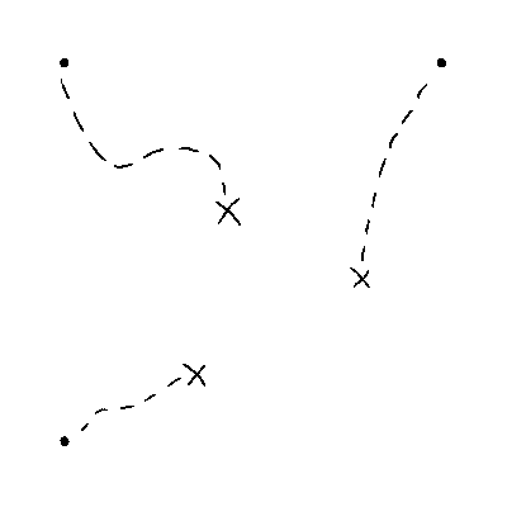

# BYUCTF 2022 - Treasure Scanner

## 题目简述

附件名为 `QRcode.jpg`，魔数却表明它是 PNG。可见二维码被三块 2×2 模块破坏，同时最低有效位中还藏着一张由圆点、虚线和 `X` 构成的“藏宝图”。


## 解题过程

提取任一 RGB 通道的 bit 0，可得到三条从圆点通向 `X` 的路径：



圆点表示黑色 2×2 模块原本所在位置，`X` 表示该模块当前被移到的位置。把藏宝图与二维码按相同尺寸叠加，分别将三个 `X` 处的 2×2 黑模块移回对应圆点，并把原位置擦成白色。

仓库图片是 400×400、31 模块二维码，模块边界约每 13 像素一次。按藏宝图完成三次移动后得到：


该结果已用二维码扫描器实际验证，内容为：

```text
byuctf{moving_black_boxes_is_fun}
```

## 方法总结

本题同时使用格式伪装、LSB 隐写和空间重排。先从最低位提取操作说明，再把说明与可见层进行坐标对齐；路径本身不是要扫描的图，而是修复二维码的数据。
