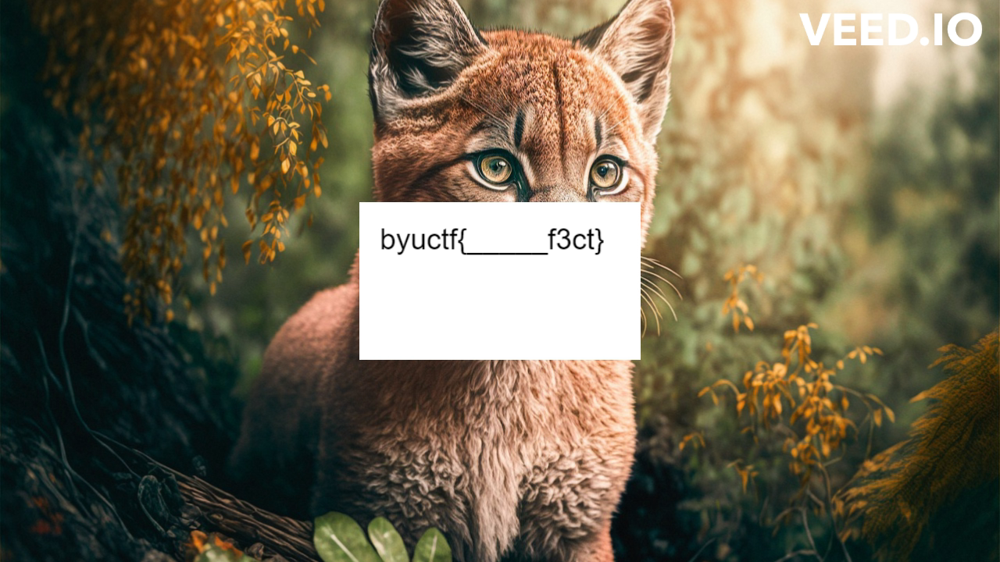

# BYUCTF 2023 - What does the cougar say?

## 题目简述

附件是一段约 87.4 秒的美洲狮视频。flag 被拆成两部分：一部分只出现一帧，另一部分以文字形状写入音轨频谱。

## 解题过程

先对连续帧做差。约 61.9 秒出现显著差分峰值，抽取该帧可见模板 `byuctf{_____f3ct}`：



音轨按原 44.1 kHz 展示时文字被压缩在低频区域。将采样数据按 5000 Hz 解释，相当于把时间轴拉长并把频率轴缩到约 2.5 kHz；对原视频约 15–27 秒的音频生成频谱，可直接看出 `byuctf{Purrr____}`：

```bash
ffmpeg -ss 15 -t 12 -i baby_cougar.mp4 \
  -lavfi "asetrate=5000,showspectrumpic=s=2800x1000:legend=1:color=rainbow:scale=log" \
  -frames:v 1 spectrum.png
```


将频谱中的 `Purrr` 与单帧中的 `f3ct` 合并：

```text
byuctf{Purrrf3ct}
```

## 方法总结

视频隐写需要分别检查时域和频域。低频文字在整段频谱中可能因横纵压缩而不可读；改变“解释采样率”会同时拉伸时间与缩放频率，比单纯对整张频谱放大更有效。
