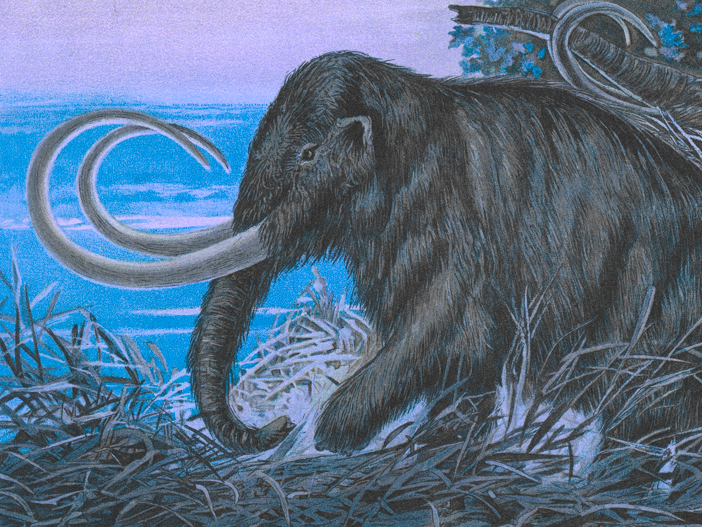

# BYUCTF 2023 - Paleontology

## 题目简述

一个 JPEG 中叠加了多层归档、图片隐写和递归压缩。每层线索指向下一种“挖掘”工具，最终从最深处的化石图片恢复 flag。

## 解题过程

首先扫描并提取 JPEG：

```bash
binwalk -e paleontology.jpg
```

得到加密的 `layers_of_dirt.7z` 和 `trapped_in.ice`。后者是 ICEOWS 归档，但题目还在文件尾附加了一张 PNG，可用文件提取工具直接 carve。图中猛犸左侧有一行极小文本：



把文字抄成命令，而不是把代码截图当作唯一说明：

```bash
tail -c 97341 paleontology.jpg > la_brea.tar.pit
```

`la_brea.tar.pit` 是 PackIt 归档，解包得到 `la_brea.tar`；再执行：

```bash
tar -xvf la_brea.tar
```

其中的 `steg.png` 经过颜色随机化/重新映射后显出单词 `sediment`，它正是第一层 7z 的密码：

```bash
7z e layers_of_dirt.7z -psediment
```

解出 `dirt.zip` 后会遇到多层嵌套 ZIP。逐层解压直到出现 `fossil.jpg`，最后运行：

```bash
strings fossil.jpg | grep 'byuctf{'
```

得到：

```text
byuctf{f055il5_4r3_4m4zing!}
```

## 方法总结

多层隐写题应为每一步记录“输入文件、识别依据、提取命令、输出文件”，避免递归解压时丢失证据链。文件扩展名多次故意误导，魔数、binwalk 偏移和可视线索才是可靠路由。
