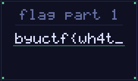

# Inception

## 题目简述

附件 `inception` 同时包含 PNG、ZIP 和 PDF 三种文件结构，flag 被分成三段，分别放在三个载体中。需要按文件签名和结构边界逐层提取，而不是只相信扩展名或首个文件头。

## 解题过程

文件开头是 PNG 签名。直接作为图片打开可以读到第一段：

    byuctf{wh4t_

解析 PNG 块可知，`IEND` 之后的偏移 823 处出现 ZIP 本地文件头。让解压工具直接读取原文件，或从该偏移切出数据，压缩包内的 `data.bin` 内容为第二段：

    th3

继续搜索文件签名，在偏移 964 处找到 `%PDF-`。提取该段为 PDF 后逐页检查；文档只有一页，页面正文显示第三段：

    _fr3ak}

三段按载体出现顺序连接，得到：

    byuctf{wh4t_th3_fr3ak}

PDF 页面只是居中的纯文本，没有额外版式信息，因此正文完整转写后不再保存页面截图；PNG 中的第一段则与“同一文件可被识别为图片”这一机制直接相关，故保留为视觉证据。

## 方法总结

多格式复合文件要同时检查文件头、文件尾和解析器容忍的尾随数据。PNG 在 `IEND` 后允许存在解析器忽略的内容，ZIP 可通过末尾目录定位成员，PDF 又能从自身头部开始解析。每提取一层都应使用对应解析器验证，并按实际偏移记录边界。
