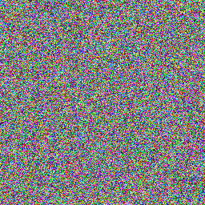

# CakeCTF2021 Break a leg

## 题目简述

附件是一张 256×256 的 RGB 噪声图。生成器把 flag 视为大端整数，并在连续 RGB 通道的最低位中周期性重复其二进制位：若当前 flag 位为 1，就把随机字节与 1 做按位或；若为 0，则保留随机字节。



图像本身就是待分析的隐写载体，像素噪声和 RGB 排列是可复核证据，因此保留并重命名；它不是可用代码块替代的界面截图。

## 解题过程

### 推导重复最低位的统计性质

设 flag 的实际比特长度为 $L$，连续通道索引为 $i$，对应秘密位为 $b_{i\bmod L}$。生成字节满足

$$
d_i=\operatorname{rand8}()\mathbin{|}b_{i\bmod L}.
$$

因此：

- 若秘密位为 1，则每一次重复位置的最低位必为 1；
- 若秘密位为 0，则每次最低位独立地以约 $1/2$ 概率为 0。

对所有同余位置做按位与，就能保留真正的 1，并以 $2^{-k}$ 的概率误保留一个重复了 $k$ 次的 0。图中共有 $256\times256\times3=196608$ 个通道，重复次数足够多，误判概率可以忽略。

### 枚举未知周期并恢复整数

生成器没有保存 $L$，但 flag 规模显然在数百位。对候选长度 100 到 999 分别分组，把每组初值设为 1，再与对应 LSB：

```python
from PIL import Image

img = Image.open("distfiles/chall.png").convert("RGB")
bits = []
for pixel in img.getdata():
    bits.extend(channel & 1 for channel in pixel)

for bitlen in range(100, 1000):
    recovered = [1] * bitlen
    for i, bit in enumerate(bits):
        recovered[i % bitlen] &= bit

    value = sum(bit << i for i, bit in enumerate(recovered))
    raw = value.to_bytes((value.bit_length() + 7) // 8, "big")
    if raw.startswith(b"CakeCTF{") and raw.endswith(b"}"):
        print(raw.decode())
```

最低位的周期顺序是整数从低位到高位，所以用 `bit << i` 重建整数；随后按大端转字节，恰好抵消生成器的 `int.from_bytes(..., "big")`。

恢复结果为：

```text
CakeCTF{1_w1sh_y0u_can_h1t_the_gr0und_runn1ng_fr0m_here;)-d7bcfa74ad4bc}
```

## 方法总结

- 这不是普通的单次 LSB 读取，而是“秘密位为 1 时强制置位、为 0 时留下随机噪声”的重复信道。
- 对同一秘密位的多次观测取 AND，可以把随机 1 消掉；重复次数越多，误保留 0 位的概率越低。
- 周期未知时可枚举合理 bit length，并用 flag 前后缀同时筛选，避免把随机候选误判为答案。
