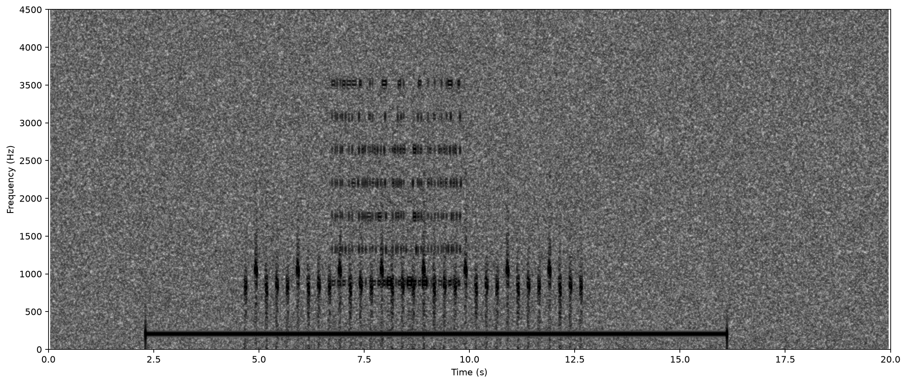

# DownUnderCTF 2020 - On the spectrum

## 题目简述

题目给出一段约 20 秒的 WAV。直接播放主要听到噪声，题名 “On the spectrum” 则提示信息并不依赖可听语义，而是被绘制在时频平面中。决定性载荷是频谱图里的视觉文字，因此本题归入 Stego。

## 解题过程

在 Audacity 中打开音频后，把轨道显示模式从 Waveform 切换为 Spectrogram，放大包含高能图案的时间段，即可看到噪声背景中排列出的 flag 字符。

不依赖图形界面也可以生成频谱图。下面的示例使用短时傅里叶变换：较大的 `NFFT` 提高频率分辨率，重叠窗口则避免文字笔画因时间采样过稀而断裂。

```python
from scipy.io import wavfile
import matplotlib.pyplot as plt

sample_rate, samples = wavfile.read("message_1.wav")

fig, ax = plt.subplots(figsize=(14, 6), dpi=160)
ax.specgram(
    samples,
    NFFT=4096,
    Fs=sample_rate,
    noverlap=4000,
    cmap="gray_r",
    scale="dB",
)
ax.set_xlabel("Time (s)")
ax.set_ylabel("Frequency (Hz)")
ax.set_ylim(0, 4500)
fig.tight_layout()
fig.savefig("audio-spectrogram-flag.png", bbox_inches="tight")
```



放大字符区域并逐字读取，得到：

```text
DUCTF{m4by3_n0t_s0_h1dd3n}
```

这张图保留的是音频载荷的空间证据，而不是终端输出或可直接转写的代码截图。

## 方法总结

- 核心技巧：用短时傅里叶变换把 WAV 从时域转换到时频图，读取频率能量绘制出的文字。
- 识别信号：音频听起来像随机噪声，而题名或描述强调 spectrum、frequency、signal、view 等词时，应检查频谱图而不是只做听觉分析。
- 复用要点：看不到图案时要调整 FFT 窗长、窗口重叠、动态范围和频率上限；频率分辨率过低会把细笔画抹平，时间分辨率过低则会让相邻字符粘连。
