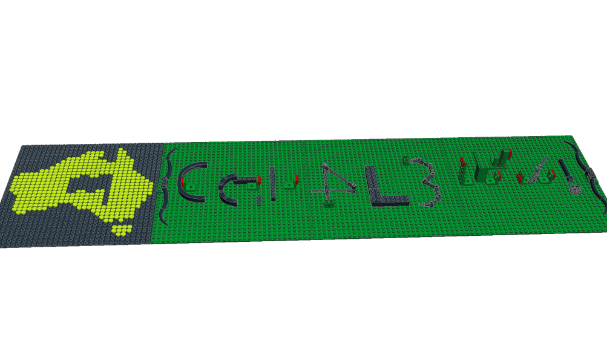
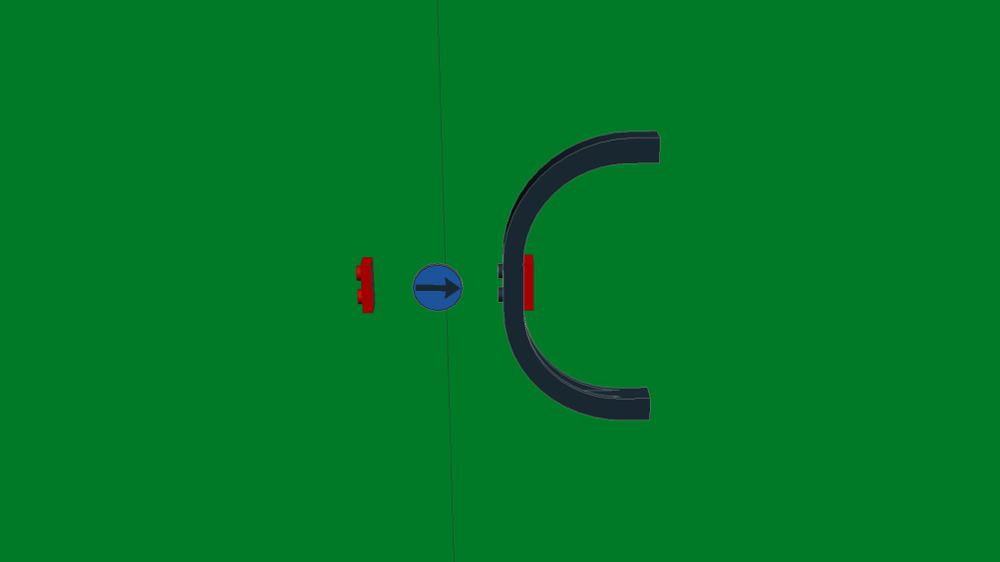
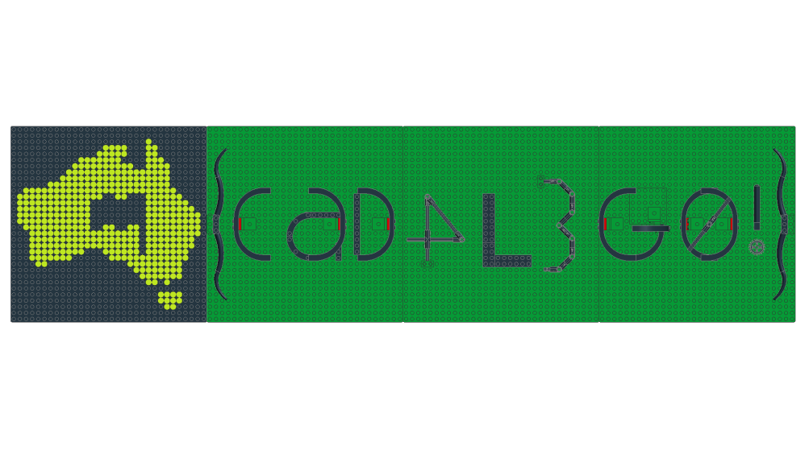

# DownUnderCTF 2021 - Builder

## 题目简述

题目只提供 `builder.mpd`。文件扩展名表明它是 LDraw 的 MPD（Multi-Part Document）模型：一个文本文件可以同时封装主场景与多个子模型。开头的 `0 FILE challenge.ldr` 用来切换子模型，类型为 `1` 的记录则依次给出颜色、三维坐标、$3\times3$ 变换矩阵和零件文件名。因此，这不是需要执行的程序，而是一份可以在 LDraw 兼容编辑器中打开和修改的乐高模型。

## 解题过程

在 LDraw 编辑器中打开模型后，正面能看到 DUCTF 标志以及一串尚未完成的乐高字符。若只从默认斜视角观察，部分字符还会因为透视和缺失零件而难以辨认。



继续旋转模型并查看绿色底板背面，可以发现被底板遮住的提示结构：一个已经完成的弧形字母 `C`，旁边的红色 `1x2` 板和蓝色箭头标出了需要补放大型弧形积木的位置与方向。



以这个 `C` 为模板，在其余红色标记处加入相同类型的弧形零件，并根据每个字符的朝向旋转零件。倒数第三个字符在斜视图中容易被误读，需要切换到接近正交的俯视角再确认轮廓。补全后的模型清楚地拼出：

```text
{CaD4L3G0!}
```



加上比赛固定前缀，得到最终 flag：

```text
DUCTF{CaD4L3G0!}
```

## 方法总结

本题的关键不是从 MPD 文本中直接猜字符，而是识别 LDraw 模型格式并利用三维视角寻找被遮挡的提示。处理此类视觉/空间隐写题时，应同时检查模型的正反面、隐藏零件、颜色异常和不同投影视角；题目中的红色定位板与示例字母共同给出了完整的补件规则。
