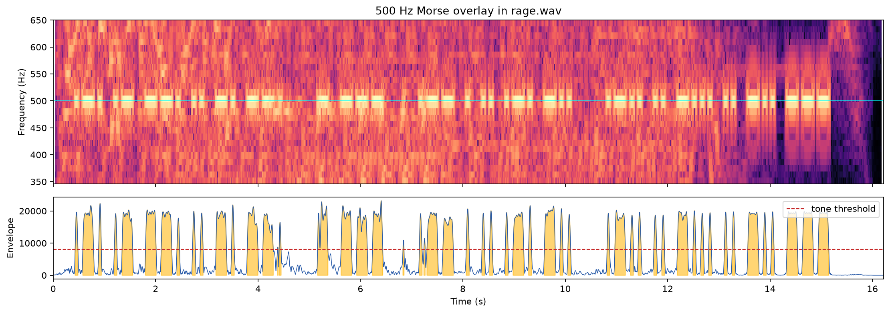

# DownUnderCTF 2022 Rage Writeup

## 题目简述

题目只提供 `rage.wav`，歌曲上叠加了一串规则的短音和长音。需要从音乐背景中定位固定频率载波，按持续时间恢复 Morse 点划，再解码出 flag 文本。

## 解题过程

原文件是 48 kHz 双声道 PCM，时长约 16.22 秒。听感上能察觉规律蜂鸣；查看 350–650 Hz 频段可见一条间歇出现的 500 Hz 水平线。对 480–520 Hz 做带通滤波，再取 Hilbert 包络，点和划的持续时间分别约为 0.055 秒和 0.205 秒，符合约 20 WPM 的 Morse 节奏。



以 500 Hz 能量阈值切分有声区间后，用短段表示 `.`、长段表示 `-`；约 0.25 秒的静音分隔字母，约 0.7 秒的静音分隔单词。得到：

```text
.-. .- --. .. -. --.  - ---  .-- . .. .-. -..  .-.. .. -... .. -.. ---
```

逐组查 Morse 表：

```text
.-.    R       -      T       .--    W       .-..   L
.-     A       ---    O       .      E       ..     I
--.    G                       ..     I       -...   B
..     I                       .-.    R       ..     I
-.     N                       -..    D       -..    D
--.    G                                      ---    O
```

明文是：

```text
RAGING TO WEIRD LIBIDO
```

题目大小写不敏感，并接受带空格或去空格形式，例如：

```text
DUCTF{RAGINGTOWEIRDLIBIDO}
```

## 方法总结

载荷不是画在整幅频谱上的文字，而是用单一 500 Hz 载波的开关时长编码 Morse。应保留原 WAV，先确认采样率和声道，再通过窄带滤波与包络把音乐能量和载波分离；点、划、字母间隔、单词间隔四种时间尺度共同提供校验。只凭听感抄写容易漏掉短点，时频图和包络应相互复核。
