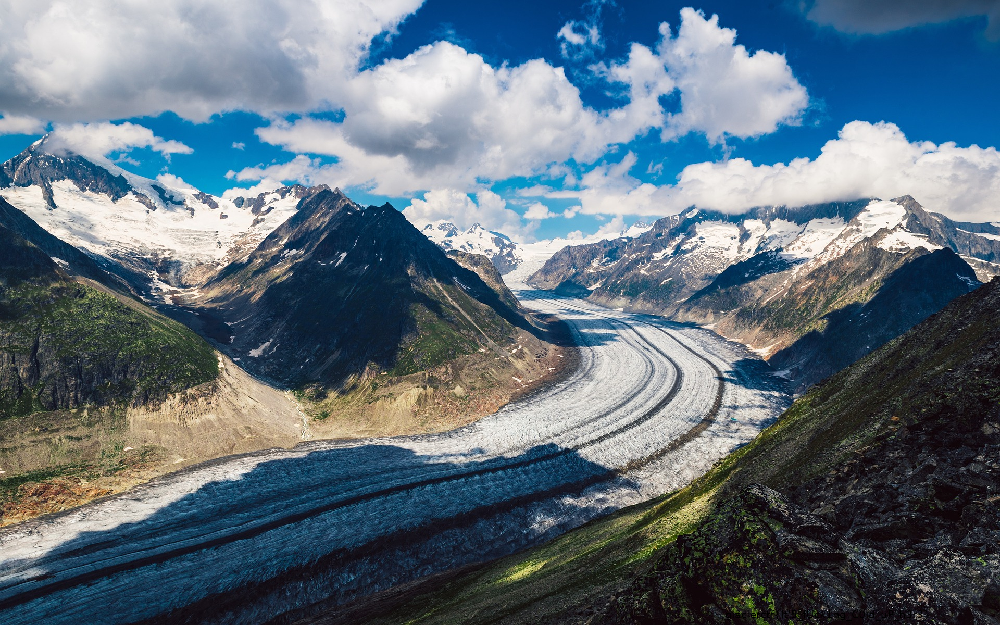

# GlacierCTF2022 - The Climber

## 题目简述

题目提供一张能正常打开的 `glacier.jpg`。文件实际由两个完整 JPEG 首尾拼接而成；第二张图片又在公开的冰川照片上叠加了低对比度文字，需要提取并与原图比较才能稳定识别 flag。

## 解题过程

扫描 JPEG 标记可见，第一张图在偏移 996159 处以 `ff d9` 结束，紧接着的偏移 996161 又出现 `ff d8`。从第二个 SOI 起切出尾部，所得文件与仓库中的 `more_glaciers.jpg` 逐字节一致：

```bash
dd if=glacier.jpg of=embedded.jpg bs=1 skip=996161 status=none
```

也可以直接用 `binwalk -e glacier.jpg` 识别并提取追加的 JPEG。



对提取图做反向图片搜索可找到未修改的同源冰川照片。将两图对齐后求绝对差并拉伸对比度，右下角新增的黑色字符会从背景中分离出来；即使直接查看高分辨率提取图，也能在右下边缘看到同一行低对比度文字。读取得到：

```text
glacierctf{It'5_fUck1ng_C0ld_uP_h3r3}
```

## 方法总结

“能正常显示”不代表文件在首个 EOI 后结束，应同时检查文件尾、嵌套 magic 和实际尺寸。追加文件提取后，反向图片搜索提供干净基线，像素差分则把轻微覆盖从复杂自然背景中放大；两层隐藏都由载荷定位与视觉差异主导，因此归 Stego。
