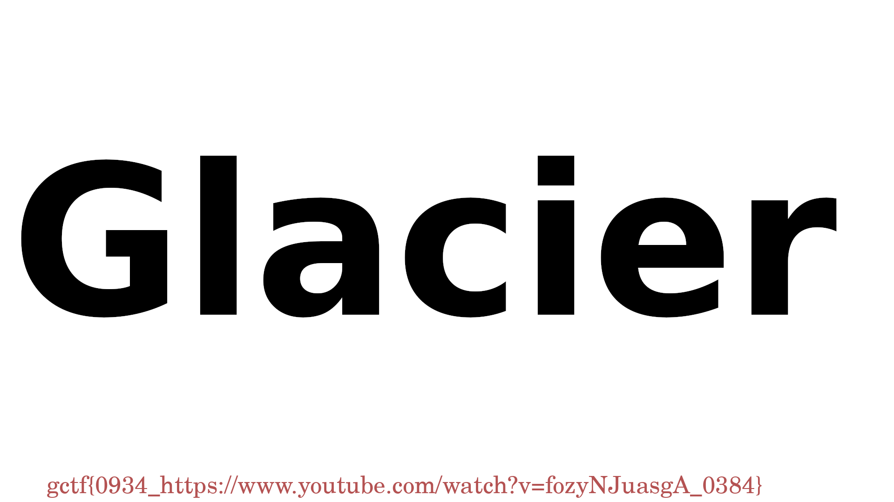

# GlacierCTF 2024 FindMe

## 题目简述

附件 `chall.pdf` 可以正常打开，三个可见页面只有 Lorem ipsum 文本和空白区域。逐页视觉对照 `base.pdf` 与 `chall.pdf` 后也看不到 flag；差异位于 PDF 页面树之外的对象流。

生成器先把 flag 绘制到一张 PNG，再将完整 PNG 每 100 字节切成一块，从对象号 20 开始依次写入未被页面引用的新 stream。解题目标是按对象顺序取出这些流并无损拼接，而不是 OCR 可见 PDF 页面。

## 解题过程

### 1. 区分可见内容与隐藏对象

仓库中的两个真实 PDF 都有 3 页。逐页渲染检查结果为：

- `base.pdf`：第 1 页为整页 Lorem ipsum，第 2 页空白，第 3 页只有页首两行文字；
- `chall.pdf`：仍然只有同类占位文本，没有新增图片或可见 flag；
- `solution/chall.pdf` 与 `dist/chall.pdf` 只是内容为 `../challenge/chall.pdf` 的 22 字节路径占位文件，不是另两份 PDF。

直接查看对象流时，对象 20 的数据以 PNG 签名 `89 50 4e 47 0d 0a 1a 0a` 开头，最后一个分块以 PNG 的 `IEND ae 42 60 82` 结尾。这两项同时验证了载荷格式和边界。官方 WP 中的 `Start.png`、`End.png` 只是终端内容截图，正文将关键信息转写为文本，不再保留它们。

### 2. 按 xref 顺序重组 PNG

PyMuPDF 可以直接读取对象的原始 stream。官方 solver 从 20 遍历到 xref 表末尾，将每个非空流按顺序写入：

```python
import fitz

with fitz.open("chall.pdf") as doc, open("solve.png", "wb") as out:
    for xref in range(20, doc.xref_length()):
        chunk = doc.xref_stream(xref)
        if chunk:
            out.write(chunk)
```

对仓库原件复核得到 `xref_length() == 744`，对象 20 至 743 共 724 个有效分块，拼接后为 72,390 字节；文件头、文件尾和图像解码均正常。不要按文本模式读取，也不要把 stream 之间的人类可读 PDF 语法一并写入。

### 3. 读取恢复图像

重组结果是一张带 Glacier 标志的图片，flag 位于底部：



```text
gctf{0934_https://www.youtube.com/watch?v=fozyNJuasgA_0384}
```

## 方法总结

本题利用 PDF 容器允许存在未被页面引用的附加对象，将 PNG 伪装成大量普通 stream。可靠证据链是“逐页确认可见内容无异常 → 定位 PNG 头尾 → 按 xref 顺序提取对象 20 之后的流 → 校验 PNG 结构和解码结果”。遇到类似文档隐写时，页面渲染、文本提取和对象级检查应分开进行，不能因为 PDF 外观正常就忽略孤立对象。
