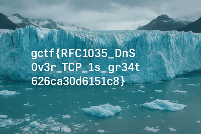

# GlacierCTF 2025 rfc1035

## 题目简述

题目提供一个自定义 Go DNS 服务。它只为 `flag.example.com` 的 TXT 查询返回数据：UDP 路径故意不给出有效内容，TCP 路径则把一张 PNG 的原始字节装进 TXT RDATA。任务是正确恢复 `dig` 展示层中的分段和转义，重建图片。

图片被有意藏在协议载荷中，关键障碍是定位并重组隐蔽载荷，因此归入隐写。

## 解题过程

### 1. 强制走 DNS over TCP

使用题目给出的地址和端口查询：

```bash
dig +tcp +short @<host> -p <port> flag.example.com TXT > answer.txt
```

DNS over TCP 在每个 DNS message 前还有一个 2 字节长度字段，服务端源码手工构造了该帧。客户端不需要自己处理这个字段，`dig` 已经完成 TCP framing 和 DNS 解析。

题目灵感来自 [Images over DNS](https://dgl.cx/2025/09/images-over-dns)。原文最关键的结论是：RFC 1035 限制的是 TXT RDATA 内每个 `character-string` 最多 255 字节，而不是整个 TXT RR 只能有 255 字节；一个 TXT RR 可以连续放置多个长度前缀字符串。TCP 又允许约 64 KiB 的 DNS message，所以足以承载这张 PNG。这里已经将外链所需原理写入正文。

### 2. 去掉 TXT 分段并反解展示转义

服务端的 `packTXTRecord` 将 PNG 每 255 字节切一段，编码为：

```text
[1-byte length][up to 255 raw bytes][1-byte length][next bytes]...
```

`dig` 的输出不是原始 RDATA。它给每段加引号，以 `" "` 分隔相邻字符串，并把不可打印字节显示成 `\DDD` 十进制转义；反斜杠和双引号也会额外转义。因此不能直接 Base64 解码，也不能把文本原样重命名成 `.png`。

仓库 solver 使用如下处理流程：

```bash
dig +tcp +short @<host> -p <port> flag.example.com TXT \
  | perl -pe 'chomp; s/" "//g; s/^"//; s/"$//; s/\\(\d{3})/chr $1/eg; s/\\([\\"])/$1/g' \
  > dns-reassembled-flag.png
```

第一组替换拼回多个 character-string，第二组去掉最外层引号，随后把 `\DDD` 还原为字节，并解除 `\\`、`\"`。输出应以 PNG magic 开头：

```text
89 50 4e 47 0d 0a 1a 0a
```

### 3. 查看重建图片



图中 flag 为：

```text
gctf{RFC1035_DnS_0v3r_TCP_1s_gr34t_626ca30d6151c8}
```

## 方法总结

本题同时利用了 TXT 的内部多字符串结构、TCP DNS 的大报文能力和 `dig` 的 presentation format。恢复协议隐蔽载荷时要明确区分三层：DNS wire bytes、TXT character-string 分段、命令行工具为可读性添加的引号与转义。先按源码确认查询名和传输协议，再逐层逆变换，并用文件 magic 或哈希验证结果；仅凭 OCR 读出 flag 而不验证重建图片，会遗漏最关键的协议证据。
