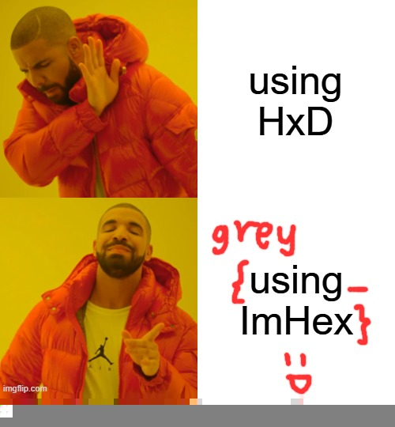

# Incomplete Meme

## 题目简述

附件是能够正常打开的 JPEG，但只显示 500×270 的上半部分；题面提示原图下面还有一个面板。真实像素扫描数据仍在文件中，SOF0 帧头却把高度写小，导致解码器提前截断显示。目标是恢复被尺寸元数据隐藏的下半图像。

## 解题过程

在偏移 `0x278` 处可见 SOF0 段：

```text
FF C0 00 11 08 01 0E 01 F4 ...
               └───┘ └───┘
               270   500
```

JPEG 的高度和宽度均以大端序保存。将偏移 `0x27D:0x27F` 的高度 `0x010E`（270）改为 `0x021C`（540），宽度 `0x01F4`（500）保持不变：

```python
from pathlib import Path

data = bytearray(Path("meme.jpeg").read_bytes())
data[0x27D:0x27F] = (540).to_bytes(2, "big")
Path("recovered-meme.jpeg").write_bytes(data)
```

修复后的完整双栏梗图显示原先被隐藏的第二个面板，其中写有 flag：



```text
grey{using_ImHex}
```

## 方法总结

能正常打开但画面明显缺失时，要检查 JPEG 的 SOF 高宽，而不只看文件尾是否存在数据。此类题的关键是区分“像素数据被删除”和“解码范围被元数据缩小”：修改尺寸后若隐藏区域完整出现，就证明扫描数据从未丢失。
