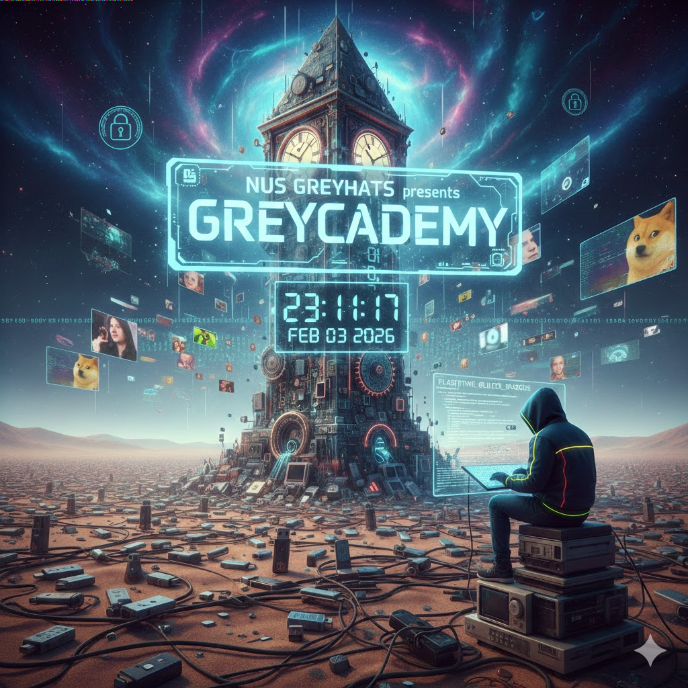

# Look at the Top Left

## 题目简述

附件是一张能够正常显示的 JPEG 海报，但图像最上方出现了一排不自然的彩色像素。题目提示工具失效，是因为信息没有藏在常见的最低有效位，而是依次写入 RGB 三通道的最高有效位。

## 解题过程

先直接观察原图。主体画面没有异常，真正的视觉线索集中在最上方：一串离散的高亮像素横跨左上区域，这也是图片中需要保留的证据。



按行优先遍历像素，对每个像素依次取红、绿、蓝通道的第 7 位，拼成比特流，再每 8 位还原一个字节：

```python
from PIL import Image

image = Image.open("encoded-msb-pixels.jpg").convert("RGB")
bits = []

for red, green, blue in list(image.getdata())[:200]:
    bits.extend([
        (red >> 7) & 1,
        (green >> 7) & 1,
        (blue >> 7) & 1,
    ])

output = bytearray()
for offset in range(0, len(bits) - 7, 8):
    value = 0
    for bit in bits[offset:offset + 8]:
        value = (value << 1) | bit
    output.append(value)
    if value == ord("}"):
        break

print(output.decode())
```

输出为：

```text
grey{did-you-know-that-JPG-is-lossy-thats-why-the-flag-cant-be-in-the-LSB}
```

生成端先修改最高位，再以 JPEG quality 100、无色度抽样保存。JPEG 压缩会轻易扰动 LSB，但如此显著的通道最高位在本题参数下得以保留，这与 flag 文本本身的提示相呼应。

## 方法总结

位平面隐写不应默认只查 LSB。图像出现肉眼可见的彩色噪点时，应分别查看 RGB 的各个位平面，特别是高位。JPEG 是有损格式，低位信息通常不稳定；若编码者故意使用 MSB，载荷会更稳健，却也会留下明显的视觉痕迹。
