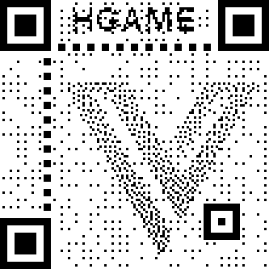

# Cosmos 的午餐

## 题目简述

附件包含一份伪装为图片扩展名的网络抓包和 `ssl_log.txt`。需要用 TLS key log 解密 HTTPS 流量，从重组后的 HTTP 对象中导出 ZIP，再依据图片元数据中的密钥提取 Outguess 隐写。隐藏内容原本指向一个下载包，最终得到经过艺术化破坏的二维码。

## 解题过程

在 Wireshark 的 TLS 协议设置中，把 `(Pre)-Master-Secret log filename` 指向题目提供的 `ssl_log.txt`。重新载入抓包后，TLS Application Data 会被解密为 HTTP。

不要只保存某一个 TCP/TLS 分段；使用 `File -> Export Objects -> HTTP` 导出 Wireshark 已重组的对象。导出的 ZIP 中包含：

```text
Outguess with key.jpg
```

题目提示 Cosmos 会把东西写进图片备注。检查 EXIF/文件属性可得：

```text
Key: gUNrbbdR9XhRBDGpzz
```

用 Outguess 提取：

```bash
outguess -r -k gUNrbbdR9XhRBDGpzz "Outguess with key.jpg" out.txt
```

`out.txt` 当时给出一个短链接。该链接本身不是解题知识，且现在可能失效；其重要内容是下载 `ScanMe.zip`，解压得到下面这张 `Logo.png` 艺术二维码：



三个定位点的中心只保留了 $3\times3$ 黑块，外围模块被视觉设计破坏。按标准 QR 定位图案把这些小块扩展到完整模块，HGAME 和 Vidar 标志覆盖的少量数据则可依靠二维码纠错恢复。扫码得到：

```text
hgame{ls#z^$7j%yL9wmObZ#MKZKM7!nGnDvTC}
```

## 方法总结

- 核心链路：TLS key log 解密流量、导出重组 HTTP 对象、元数据取 Outguess 密钥、修复艺术二维码定位图案。
- 识别信号：抓包旁附带 `ssl_log` 时，应优先配置 TLS key log；图片名写着 `with key` 时，还应检查注释和 EXIF。
- 复用要点：网络文件必须从完整应用层对象导出，不能把单个分段误当文件；失效短链的关键落地内容应写进 WP，避免读者依赖外部跳转。
