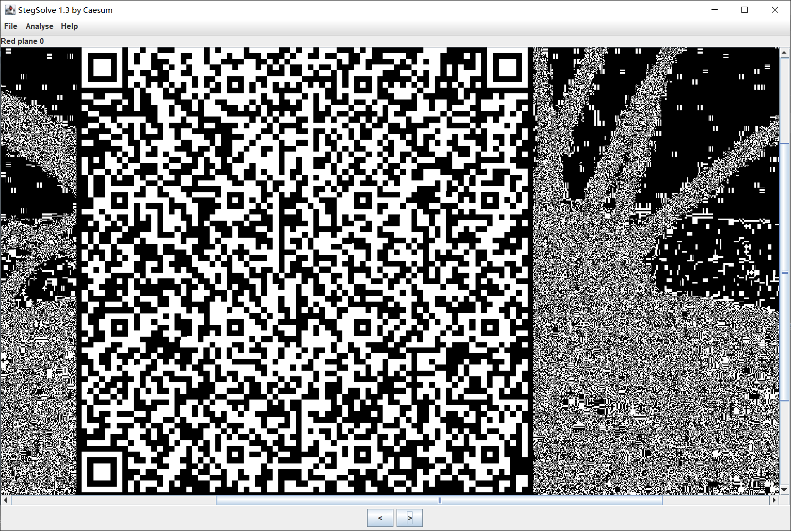

# Hallucigenia

## 题目简述

附件图片同时使用了位平面隐藏、反色二维码、Base64 和字节序翻转。先在低位平面中找到二维码，扫码恢复一段 Base64；解码后的数据还不是可直接打开的 PNG，需要把整个字节序列逆序，并将恢复出的图像上下翻转才能读到 flag。

## 解题过程

用 StegSolve 逐个查看颜色通道的位平面，在红色通道最低位平面中能看到一个二维码。它的黑白关系与普通二维码相反，但定位图形仍然清晰：



将这一位平面反色后扫码，得到以下 Base64 数据：

```text
gmBCrkRORUkAAAAA+jrgsWajaq0BeC3IQhCEIQhCKZw1MxTzSlNKnmJpivW9IHVPrTjvkkuI3sP
7bWAEdIHWCbDsGsRkZ9IUJC9AhfZFbpqrmZBtI+ZvptWC/KCPrL0gFeRPOcI2WyqjndfUWlNj+d
gWpe1qSTEcdurXzMRAc5EihsEflmIN8RzuguWq61JWRQpSI51/KHHT/6/ztPZJ33SSKbieTa1C5k
oONbLcf9aYmsVh7RW6p3SpASnUSb3JuSvpUBKxscbyBjiOpOTq8jcdRsx5/IndXw3VgJV6iO1+6j
l4gjVpWouViO6ih9ZmybSPkhaqyNUxVXpV5cYU+Xx5sQTfKystDLipmqaMhxIcgvplLqF/LWZzIS
5PvwbqOvrSlNHVEYchCEIQISICSZJijwu50rRQHDyUpaF0y///p6FEDCCDFsuW7YFoVEFEST0BAA
CLgLOrAAAAAggUAAAAtAAAAFJESEkNAAAAChoKDUdOUIk=
```

直接 Base64 解码会得到一个二进制文件。十六进制视图中可以发现 `PNG`、`IHDR` 等标记以相反顺序出现，说明不是 PNG 内部字段的小端问题，而是整个文件的字节序列被倒置。先逆序恢复文件，再把图像上下翻转：

```python
from base64 import b64decode
from io import BytesIO
from pathlib import Path

from PIL import Image, ImageOps

encoded = """gmBCrkRORUkAAAAA+jrgsWajaq0BeC3IQhCEIQhCKZw1MxTzSlNKnmJpivW9IHVPrTjvkkuI3sP
7bWAEdIHWCbDsGsRkZ9IUJC9AhfZFbpqrmZBtI+ZvptWC/KCPrL0gFeRPOcI2WyqjndfUWlNj+d
gWpe1qSTEcdurXzMRAc5EihsEflmIN8RzuguWq61JWRQpSI51/KHHT/6/ztPZJ33SSKbieTa1C5k
oONbLcf9aYmsVh7RW6p3SpASnUSb3JuSvpUBKxscbyBjiOpOTq8jcdRsx5/IndXw3VgJV6iO1+6j
l4gjVpWouViO6ih9ZmybSPkhaqyNUxVXpV5cYU+Xx5sQTfKystDLipmqaMhxIcgvplLqF/LWZzIS
5PvwbqOvrSlNHVEYchCEIQISICSZJijwu50rRQHDyUpaF0y///p6FEDCCDFsuW7YFoVEFEST0BAA
CLgLOrAAAAAggUAAAAtAAAAFJESEkNAAAAChoKDUdOUIk="""

raw = b64decode("".join(encoded.split()))
png_data = raw[::-1]
assert png_data.startswith(b"\x89PNG\r\n\x1a\n")
Path("flag-recovered.png").write_bytes(png_data)

image = Image.open(BytesIO(png_data))
ImageOps.flip(image).save("flag-upright.png")
```

翻转后的图中文字为：

```text
hgame{tenchi_souzou_dezain_bu}
```

最终文字只是 flag 本身，已转写为文本，因此没有再保留那张狭长结果截图。

## 方法总结

位平面中出现二维码定位块时，即使背景噪声很强，也应先检查黑白是否反转。扫码结果若 Base64 解码后不可读，可通过文件签名判断数据经历了怎样的变换；本题逆序后出现标准 PNG 签名，直接证明应对整个字节串做 `[::-1]`，而不是盲目修改 PNG 字段。
