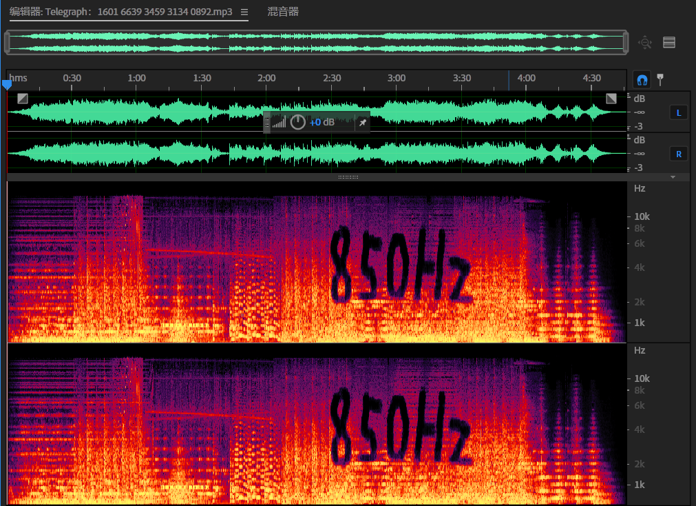

# Telegraph：1601 6639 3459 3134 0892

## 题目简述

附件是一段混有音乐的音频。题名 `Telegraph` 指向电报，后缀数字按中文摩尔斯电码解释后得到“带通滤波器”；真正的 Morse 信号被叠加在歌曲中，需要先在频谱中定位频率，再滤出并解码。

## 解题过程

试听音频可以在中段听到电报声，尾部也有不自然的高频成分。将音频导入 Adobe Audition 并切换到频谱视图，可以直接看到由能量缺口写出的 `850Hz` 字样：



放大电报声所在区间后，信号约以 $850\ \mathrm{Hz}$ 为中心、占据 $200\ \mathrm{Hz}$ 带宽。因此可设置：

```text
滤波类型：带通
中心频率：850 Hz
低频截止：750 Hz
高频截止：950 Hz
```

FFT 滤波器或科学滤波器均可。选中含 Morse 的区间完成带通滤波，再把结果单独导出。将音频交给 [Morse Code World 自适应音频解码器](https://morsecode.world/international/decoder/audio-decoder-adaptive.html)，可得到 `YOUR FLAG IS` 后的字符；PDF 说明网页字体容易混淆字母 `O`、数字 `0` 以及 `I`、`1`，应复制文本并结合官方结果核对。最终 flag 为：

```text
hgame{4G00DS0NGBUTN0T4G00DMAN039310KI}
```

在线工具只负责 Morse 识别，正文已经保留了定位频率、滤波参数和解码结果，不需要访问链接才能理解解题链。

## 方法总结

音频隐写题的关键不一定是“听出内容”，频谱本身也能承载视觉提示。题名和数字先给出滤波类型，频谱中的 `850Hz` 再给出中心频率，信号宽度决定截止范围；把这些线索组合起来，才能从音乐中分离出足够干净的 Morse 信号。
