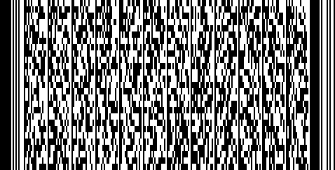
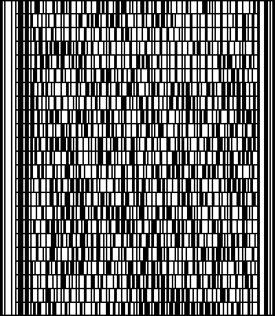
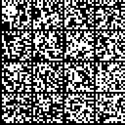
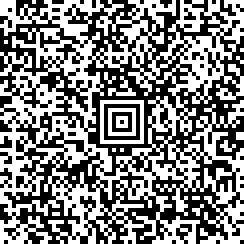
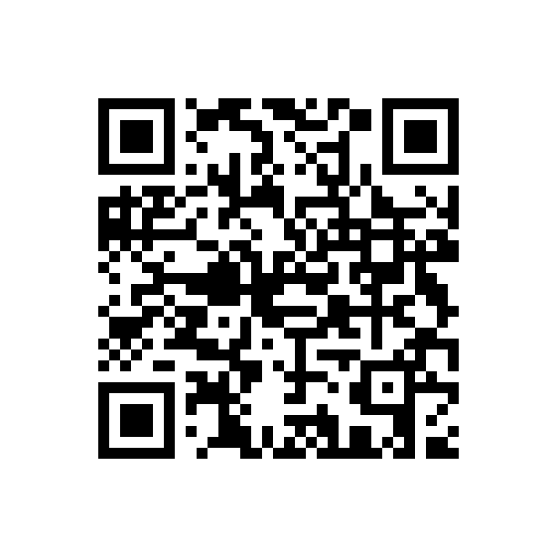

# 你上当了，我的很大

## 题目简述

题目给出层层嵌套的压缩包与若干视频。真正的载荷不在视频画面主体，而在部分视频末尾附带的二维条码中。官方题解同时说明，出题时存在打包遗漏，因此不能只依赖附件中的视频凑齐全部数据；结合题面补充内容后，一共需要处理 PDF417、Codablock F、Data Matrix 和 Aztec 四种码。

每个码扫描后得到的都不是 flag，而是一段 Base64 文本。将文本解码为 PNG 后，四张图片分别是同一个 QR 码的四个局部，必须重新拼接才能得到最终结果。

## 解题过程

先递归解压附件，并检查每段视频的最后几帧。视频主体没有决定性信息，重点是片尾出现的黑白图形。由于赛题打包时遗漏了部分内容，最终应以“凑齐下面四种条码”为检查标准，而不是以视频数量为标准。









用支持相应制式的条码阅读器逐一扫描，并将输出的 Base64 文本分别保存为 `pdf417.txt`、`codablockf.txt`、`datamatrix.txt` 和 `aztec.txt`。随后解码为图片：

```bash
base64 -d pdf417.txt > qr-top-left.png
base64 -d codablockf.txt > qr-top-right.png
base64 -d datamatrix.txt > qr-bottom-left.png
base64 -d aztec.txt > qr-bottom-right.png
```

如果阅读器把 Codablock F 当作多行 Code 128 返回，会看到每行各有一段文本。此时要按从上到下的顺序拼接：去掉每行开头的行标识字符，并删除最后一行中位于 Base64 填充符 `==` 之后的四位 Codablock 控制数据，剩余内容才是完整的 Base64。

解码后的四块尺寸分别为：

- 左上：$18\times17$；
- 右上：$17\times18$；
- 左下：$17\times18$；
- 右下：$18\times17$。

四块面积之和为 $4\times306=1224$，比 $35\times35=1225$ 恰好少一个像素。按四个定位图案和边缘纹理确定方向后，它们会组成一个缺少中心像素 $(17,17)$ 的 $35\times35$ 网格。下面的脚本完成拼接；中心像素设为黑色即可，设为白色也能被 QR 纠错恢复。

```python
from PIL import Image, ImageOps

top_left = Image.open("qr-top-left.png").convert("1")
top_right = Image.open("qr-top-right.png").convert("1")
bottom_left = Image.open("qr-bottom-left.png").convert("1")
bottom_right = Image.open("qr-bottom-right.png").convert("1")

assert top_left.size == (18, 17)
assert top_right.size == (17, 18)
assert bottom_left.size == (17, 18)
assert bottom_right.size == (18, 17)

qr = Image.new("1", (35, 35), 255)
qr.paste(top_left, (0, 0))
qr.paste(top_right, (18, 0))
qr.paste(bottom_left, (0, 17))
qr.paste(bottom_right, (17, 18))
qr.putpixel((17, 17), 0)

# 增加静区并按最近邻放大，便于扫码器识别。
qr = ImageOps.expand(qr, border=8, fill=255)
qr.resize((612, 612), Image.Resampling.NEAREST).save("stitched-qr.png")
```



扫描拼接结果得到：

```text
hgame{Do_y0U_lIk3_MazE5?}
```

## 方法总结

本题的关键不是对视频做复杂取证，而是识别片尾的多种二维条码，并看出四次 Base64 解码结果只是 QR 的局部。四块图片的尺寸还给出了明确的拼接约束：总面积只比 $35\times35$ 少一个中心像素，配合三个 QR 定位图案即可唯一确定四块的位置。遇到附件与题面不一致时，应先依据官方说明确认打包缺失，再以完整证据链为目标补齐输入，避免在缺失的视频上反复尝试。
