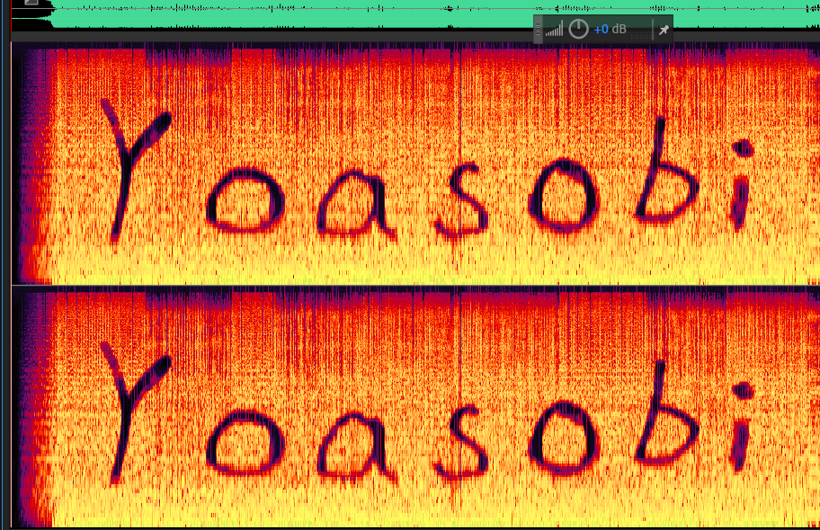
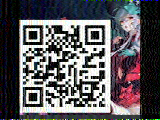

# 群青（其实是幽灵东京）

## 题目简述

附件是一段 WAV 音频，解题链包含频谱文字、SilentEye 音频隐写和 SSTV 图像传输。先从频谱获得口令 `Yoasobi`，再用该口令解出第二段音频，最后将 SSTV 信号还原为带二维码的图像。

## 解题过程

先在 Audacity 中把轨道显示方式切换为频谱图。频谱中清楚写着 `Yoasobi`：



音频元数据还提示尝试 SilentEye。用 SilentEye 选择 WAVE 解码、AES256，并把 `Yoasobi` 作为密钥，可以恢复一段文本，其中给出第二个音频地址：

```text
https://potat0-1308188104.cos.ap-shanghai.myqcloud.com/Week1/S_S_T_V.wav
```

文件名已经说明第二段音频是 SSTV。将音频送入 RX-SSTV、Black Cat SSTV 等解码器；如果软件只能从声卡采集，可使用虚拟音频线把播放器输出接到解码器输入。恢复出的画面包含一个二维码：



扫描二维码得到：

```text
hgame{1_c4n_5ee_the_wav}
```

## 方法总结

音频隐写题应依次检查频谱、元数据和专用隐写工具。这里的 `Yoasobi` 既是频谱内容也是下一层密钥，SilentEye 输出的 URL 又用文件名提示 SSTV。两张保留图片分别承担“口令证据”和“最终二维码载荷”的视觉作用，其余软件界面已改写为文字参数。
