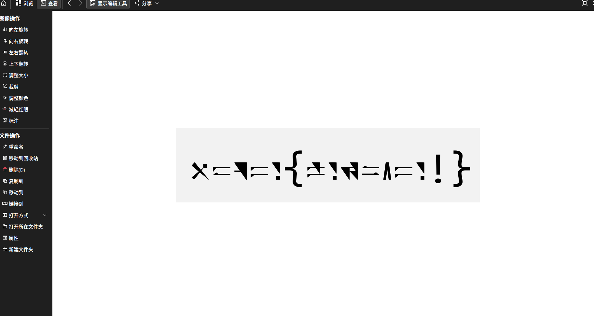

# 来自星尘

## 题目简述

附件 `secret.jpg` 使用 steghide 弱口令隐藏了一个 ZIP。压缩包内的图片不是普通乱码，而是用《来自星尘》相关的 `Ctrl Astr 3.14` 特殊字体显示 ASCII 文本；取得字体后逐字比对即可恢复 flag。

## 解题过程

先尝试常见弱口令。口令 `123456` 可以直接提取隐藏文件：

```bash
steghide extract -sf secret.jpg -xf extracted.zip -p 123456
unzip extracted.zip
```

解压后得到一张由特殊几何笔画组成的文本图片：



这不是独立设计的替换表，而是现成字体的字形。题解给出的关键名称是 `Ctrl Astr 3.14`；其[字体说明与字符预览页](https://my1l.github.io/Ctrl/CtrlAstr.html)提供字体下载和 ASCII 字符样式。安装字体后，可以采用以下任一方式比对：

- 在 VS Code 的字体预览扩展中显示 `key.ttf` 的字形表；
- 在 Windows 字体设置的预览框中输入候选字符串；
- 编写一个包含字母、数字、花括号和感叹号的字符表，用该字体渲染后逐字对照。

按图片中的字形依次映射回普通 ASCII，得到：

```text
hgame{welc0me!}
```

字体页链接只作为字体来源；识别方法、口令、提取命令和最终映射结果已经完整写入正文，不依赖读者再次打开外链才能理解解法。

## 方法总结

- 核心技巧：先用 steghide 弱口令提取文件，再识别“乱码”其实是特殊字体渲染的普通 ASCII。
- 识别信号：图中字符形状重复、有稳定基线和间距，并保留类似花括号、感叹号的结构，说明它更像字体而不是随机图案。
- 复用要点：先搜索题目主题对应的官方字体名称；字体拿到后应批量渲染完整字符集进行对照，避免凭视觉猜测相似字形。
