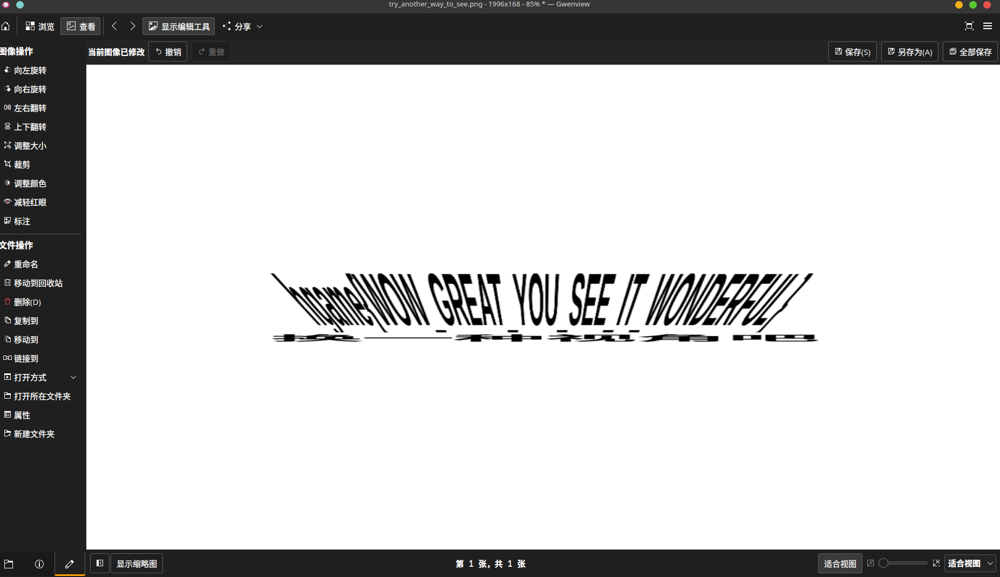

# SignIn

## 题目简述

附件是一张经过强烈纵横比变换的文字图片。正面观看时字符被压缩、拉伸并相互遮叠，但沿屏幕平面以极小视角观察，或主动改变图片宽高比例后，隐藏文字会恢复为可读形态。这是一种依赖透视和尺度的视觉隐写。

## 解题过程

最直接的方法是把图片显示在手机上，从充电口方向沿屏幕表面向内看。极端斜视会在视觉上压缩较长的轴，使原本被拉伸的字符重新接近正常比例。

也可以在图片编辑器、PPT 或脚本中解除等比例缩放，持续减小宽度或高度，直到字符可以辨认。官方题解展示了调整后的效果：

从变换后的文字可以读出 flag 内容。关键不是使用某个特定软件，而是识别出文字只在特定观察角度或纵横比下可读。

## 方法总结

- 核心技巧：通过斜视或非等比缩放还原 anamorphic text。
- 识别信号：图片中存在极度拉长、压扁或重叠的文字轮廓，直接做位平面和元数据检查没有有效结果。
- 复用要点：优先连续调节单一轴的缩放比例；保留原图副本，避免多次有损重采样破坏细线字符。
