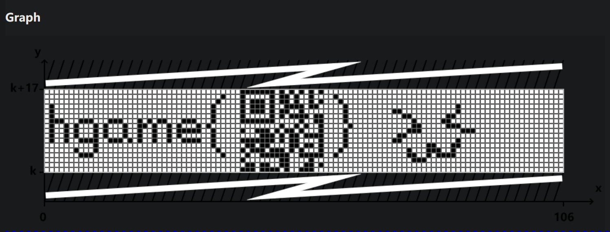
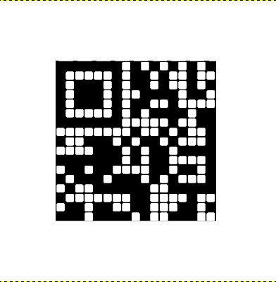

# maybezip

## 题目简述

题目把 flag 藏在一条“俄罗斯套娃”式处理链中：附件先整体异或得到加密 ZIP，再利用 PNG 结尾的已知明文恢复 ZipCrypto 密钥；解压后，按图片文件名排序并读取修改时间的奇偶性，可得到提示 `what_is_tupper`；最后把 `my_secret.txt` 中的大整数代入 Tupper 公式，图像中会出现一个 Micro QR，扫码并与图中的 flag 外壳组合得到答案。

官方 PDF 的 `maybezip` 部分只给出了一个现已无法正常取得的 `exp.ipynb` 外链，没有把步骤写进 PDF。以下流程依据附件结构和 [Mantle 的完整比赛复现](https://csmantle.top/2024/02/29/ctf-writeup-hgame2024-week4.html#maybezip) 重建；恢复密钥、偏移、隐蔽通道和最终结果均已在正文中展开，不需要打开外链才能理解解法。

## 解题过程

### 还原 ZIP 文件

原始附件不是直接可识别的 ZIP。对每个字节异或 `0x27` 后，文件头恢复为 `PK\x03\x04`：

```python
from pathlib import Path

data = Path("source.bin").read_bytes()
decoded = bytes(value ^ 0x27 for value in data)
assert decoded.startswith(b"PK\x03\x04")
Path("download.zip").write_bytes(decoded)
```

列出压缩包可见大量按三位数字命名的 PNG，以及 `out/my_secret.txt`。文件使用传统 ZipCrypto 加密，PNG 又采用 Deflate 压缩：

```powershell
bkcrack.exe -L download.zip
```

关键条目如下：

```text
Index  Encryption  Compression  Uncompressed  Packed size  Name
1      ZipCrypto   Deflate             83332        83374  out/001.png
2      ZipCrypto   Deflate             50665        50681  out/002.png
...
119    ZipCrypto   Deflate               449          240  out/my_secret.txt
```

### 利用 PNG 结尾攻击 ZipCrypto

Deflate 流开头常是依赖文件内容的动态 Huffman 块，不能直接猜出压缩明文；但本题 PNG 对应的 Deflate 流末尾存在未压缩块，因此可利用 PNG 固定的 `IEND` 尾部作为连续已知明文：

```python
from pathlib import Path

Path("end.bin").write_bytes(b"\x00\x00\x00\x00IEND\xae\x42\x60\x82")
```

该明文长度为 12 字节，满足 `bkcrack` 攻击所需的连续已知明文长度。对 `out/001.png`，packed size 为 83374；去掉 12 字节 ZipCrypto 加密头，再从末尾回退 12 字节明文，偏移为：

$$
83374-12-12=83350.
$$

执行攻击：

```powershell
bkcrack.exe -C download.zip --cipher-index 1 -o 83350 --ignore-check-byte --plain-file end.bin
```

恢复出三组内部密钥：

```text
c0e1a64f 5109d867 43f9c6e6
```

用这组密钥生成一个密码改为 `simple` 的可解压副本：

```powershell
bkcrack.exe -C download.zip -k c0e1a64f 5109d867 43f9c6e6 -U dec.zip simple
```

### 从修改时间提取隐蔽比特

解压时应保留 ZIP 中记录的修改时间。按 `001.png`、`002.png` 等数字顺序观察，时间秒数只在偶数和奇数之间变化，例如 `11:45:10` 与 `11:45:11`。把 Unix 时间戳秒数的奇偶性分别解释为 0 和 1，就得到一条按文件顺序排列的比特流。

```python
import re
from pathlib import Path


files: list[tuple[int, Path]] = []
for path in Path("dec/out").iterdir():
    match = re.fullmatch(r"(\d{3})\.png", path.name)
    if match:
        files.append((int(match.group(1)), path))

bits = "".join(
    "1" if (path.stat().st_mtime_ns // 1_000_000_000) % 2 else "0"
    for _, path in sorted(files)
)

# 原数据按高位在前编码，末尾不足一字节的部分用 0 补齐。
bits = bits.ljust(((len(bits) + 7) // 8) * 8, "0")
value = int(bits, 2)
payload = value.to_bytes(len(bits) // 8, "big").rstrip(b"\x00")
print(payload.decode("ascii", errors="ignore"))
```

输出中的有效提示为：

```text
what_is_tupper
```

这说明 `my_secret.txt` 中的大整数不是普通密钥，而是 Tupper 自指公式的图像参数。

### 绘制 Tupper 图像并恢复 Micro QR

Tupper 公式通常写为：

$$
\frac{1}{2}
<
\left\lfloor
\operatorname{mod}
\left(
\left\lfloor\frac{y}{17}\right\rfloor
\,2^{-17\lfloor x\rfloor-\operatorname{mod}(\lfloor y\rfloor,17)},
2
\right)
\right\rfloor .
$$

令 `k` 为 `my_secret.txt` 中的十进制大整数，在 $0\le x<106$、$k\le y<k+17$ 的区域作图。等价地，可以直接读取 `k // 17` 的位图位：

```python
from pathlib import Path

from PIL import Image


k = int(Path("dec/out/my_secret.txt").read_text().strip())
width, height = 106, 17
encoded = k // height

image = Image.new("1", (width, height), 1)
for x in range(width):
    for y in range(height):
        bit = (encoded >> (height * x + y)) & 1
        if bit:
            image.putpixel((x, height - 1 - y), 0)

image.resize(
    (width * 10, height * 10),
    Image.Resampling.NEAREST,
).save("tupper.png")
```

得到的图像中，左侧是 `hgame{`，中间是只有一个定位图形的 Micro QR，右侧给出闭合花括号：



普通 QR 扫描器可能因为模块太小、网格线和 quiet zone 不足而失败。按模块边界裁出中间区域，二值化后用最近邻放大，并在四周补白，可恢复为清晰的 Micro QR：



扫码得到 QR 内部载荷：

```text
Matryo5hk4_d01l
```

将它放回图中可见的 `hgame{...}` 外壳，最终 flag 为：

```text
hgame{Matryo5hk4_d01l}
```

## 方法总结

- 遇到未知文件应先验证文件头；固定单字节 XOR 可以通过 ZIP 的 `PK` 魔数快速确认。
- Deflate 不代表完全无法做已知明文攻击。若压缩流末尾使用 stored block，PNG 的固定 `IEND` 尾部仍可提供连续明文。
- ZIP 中的文件名、顺序、时间戳和权限都可能承载信息；解压或复制时若重写时间戳，会破坏本题的隐蔽通道。
- Tupper 公式的大整数本质上是按列编码的 17 像素高位图，可直接用位运算重建，不必依赖在线绘图站。
- Micro QR 只有一个定位图形；恢复时应保持整数倍模块、正确黑白极性并补足 quiet zone，不能用平滑缩放。
