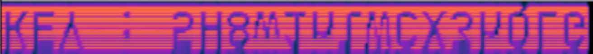
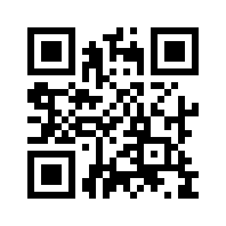

# 龙之舞

## 题目简述

题目附件 `deepsound_of_dragon_dance.wav` 是一个多层隐写载体。音频开头的频谱藏有 DeepSound 提取密码；音频内嵌的压缩包中又有一张 GIF，GIF 帧里分散着四块二维码。将碎片拼接并修复二维码的格式信息后，才能读出 flag。

## 解题过程

### 从音频频谱读取密码

播放 WAV 时，前几秒存在明显异常杂音。将音轨导入 Audacity，把显示方式从普通波形切换为频谱，即可在开头看到由能量分布画出的文字：



识别得到的 key 为：

```text
5H8w1nlWCX3hQLG
```

频谱中上下两条文字是同一密码的镜像/双声道显示，不需要把它们拼成两个字符串。

### 用 DeepSound 提取内嵌文件

在 DeepSound 2.0 中选择 `Open carrier files`，加载 `deepsound_of_dragon_dance.wav`，然后点击 `Extract secret files`。弹出密码框时输入上一步的 key，即可导出一个压缩包（官方截图中显示为 `XXX.zip`）。

解压后得到一张龙舞动画 GIF。这张动画的普通播放画面不是 flag；逐帧拆分后，可从不同帧中获得四块 $165\times165$ 的二维码碎片。可使用 ImageMagick 拆帧：

```bash
magick dragon.gif frame-%03d.png
```

然后按定位点和模块边界手工排列四块碎片。拼接后的图像已经具有二维码主体，但格式信息仍有损坏：



### 修复二维码格式信息

将拼接图导入 QRazyBox，设置为 $25\times25$ 模块，即 QR Code Version 2。在 `Tools` 中选择 `Brute-force Format Info Pattern`，让工具枚举受损的格式信息。官方复现中匹配到的参数为：

```text
Error Correction Level: L
Mask Pattern: 5
```

应用修复后的二维码如下：


关闭工具窗口，将 `Editor Mode` 切换为 `Decode Mode`，再点击 `Decode`。解码结果为：

```text
hgame{drag0n_1s_d4nc1ng}
```

## 方法总结

- 音频中短暂但突兀的杂音应同时从波形、频谱和声道差分三个角度检查；频谱文字是常见的第一层线索。
- DeepSound 的音频载体可包含受密码保护的任意文件，频谱 key 与载荷提取是两个不同阶段。
- GIF 应逐帧检查；普通播放会让短时帧和分散碎片难以被注意。
- 二维码有 Reed–Solomon 容错，但定位图形、格式信息或掩码受损时，普通扫码器仍可能失败；此时应用专用工具恢复结构参数，而不是反复对图片做模糊或锐化。
