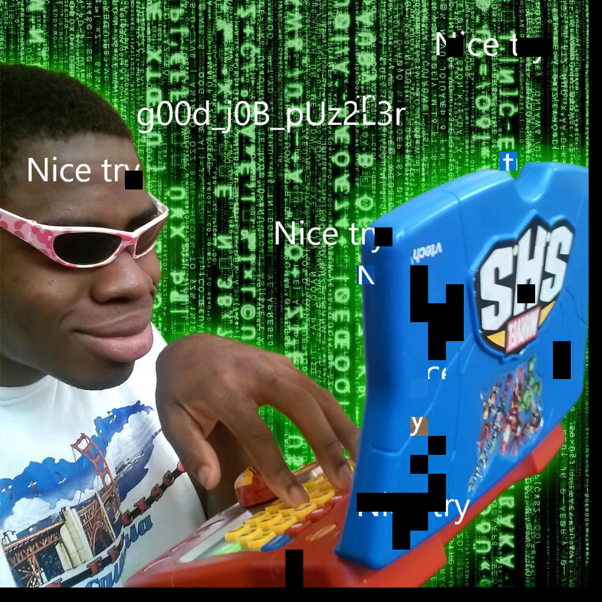

# broken-image

## 题目简述

题目把一张含有 flag 的图片切成约千个规则网格块并随机打乱，同时提供原始参考图。目标不是修复 PNG 文件头，而是利用参考图的空间布局，把每个碎片放回最相似的网格位置，重建隐藏文本。由于决定性障碍是从碎片化视觉载荷中恢复空间顺序，最终归入 Stego。

## 解题过程

官方 notebook 的生成逻辑先按接近平方的行列数切图，再随机打乱碎片文件名。求解时读取参考图和全部碎片，按相同网格尺寸计算每个候选位置。

对某个碎片 $P$ 与参考图对应位置 $R_{r,c}$，将两者转为灰度图，计算结构相似度：

$$
\operatorname{score}(r,c)=\operatorname{SSIM}(P,R_{r,c}).
$$

选择得分最高的位置并写入重建画布。核心逻辑如下：

```python
import cv2
import numpy as np
from skimage.metrics import structural_similarity as ssim

def best_position(piece, reference, rows, cols, piece_h, piece_w):
    gray_piece = cv2.cvtColor(piece, cv2.COLOR_BGR2GRAY)
    best_score = -1.0
    best_box = None

    for row in range(rows):
        for col in range(cols):
            y1, y2 = row * piece_h, (row + 1) * piece_h
            x1, x2 = col * piece_w, (col + 1) * piece_w
            region = reference[y1:y2, x1:x2]
            gray_region = cv2.cvtColor(region, cv2.COLOR_BGR2GRAY)
            score = ssim(gray_piece, gray_region)
            if score > best_score:
                best_score = score
                best_box = (y1, y2, x1, x2)
    return best_box

reconstructed = np.zeros_like(reference)
for piece in pieces:
    y1, y2, x1, x2 = best_position(
        piece, reference, rows, cols, piece_h, piece_w
    )
    reconstructed[y1:y2, x1:x2] = piece

cv2.imwrite("reconstructed.png", reconstructed)
```

如果碎片经历过压缩、缩放或噪声处理，局部最高分可能产生位置冲突；更稳健的版本应建立“碎片—位置”得分矩阵，再做一对一最大权匹配。官方数据是从参考图直接裁出的规则块，逐块最大 SSIM 已足以恢复主要内容。

官方 notebook 内嵌的重建结果如下，中央可读出 flag 主体 `g00d_j0b_pUz2L3r`：



补全标准包装得到：

```text
shellmates{g00d_j0b_pUz2L3r}
```

当前公开仓库快照没有保留 notebook 所引用的 `original.jpg` 和 `puzzle_pieces_1000/`，因此无法仅凭该快照重新执行完整匹配；但 notebook 保留了算法、运行输出和内嵌重建图。WP 明确记录这一复现边界，没有把缺失附件描述成仍然存在。

## 方法总结

- 核心技巧：用原始参考图的网格区域作为模板，通过 SSIM 将随机碎片恢复到空间位置。
- 识别信号：题目同时给出参考图和大量尺寸一致的打乱小图块时，优先做网格切分和相似度匹配，而不是传统位面隐写。
- 复用要点：行列数、裁剪尺寸和边缘余数必须与生成过程一致；存在近似块或压缩误差时要强制一对一分配，防止多个碎片覆盖同一格。
