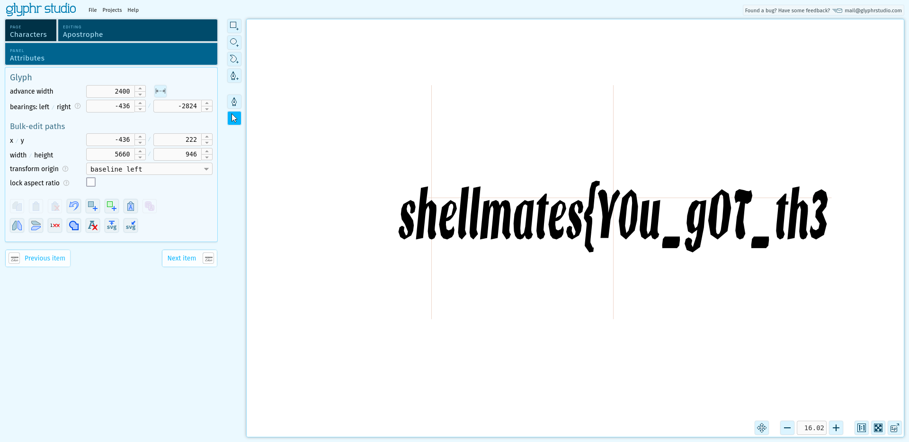
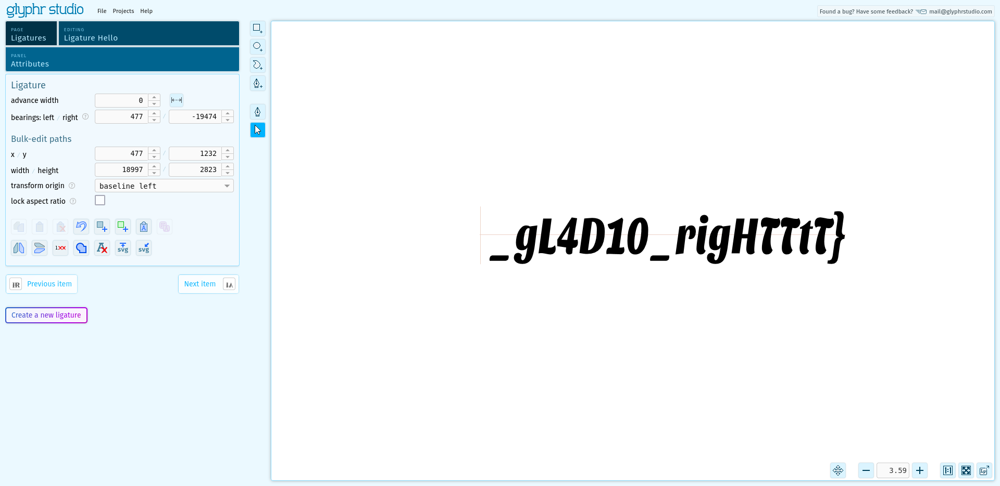

# gladios

## 题目简述

页面只是一个使用自定义字体的文本框，HTML 和 CSS 中还各放了一枚假 flag。真正的信息藏在 `gladios.otf` 的异常字形轮廓里：撇号字符对应第一段，名为 `Hello` 的连字对应第二段。由于获取答案依赖检查字体文件中的隐藏视觉载荷，而不是利用 Web 协议或服务端漏洞，本题归入隐写方向。

## 解题过程

### 排除源码中的诱饵

样式表通过 `@font-face` 加载字体，并让正文和文本框都使用它：

```css
@font-face {
    font-family: 'Gladios';
    src: url('../fonts/gladios.otf') format('opentype');
}

body, textarea {
    font-family: 'Gladios';
}
```

HTML 尾部的 `shellmates{NOT_tH4t_EA$y}` 和 CSS 注释中的 `shellmates{W3Ll_Y0u_BeTtER_trY_harDeR}` 都与官方结果不符，且名称本身提示它们是诱饵。页面没有接收或处理用户数据的后端逻辑，值得继续分析的独特附件只剩 1 MB 左右的 OTF 文件。

### 检查异常字形

把 `gladios.otf` 导入支持 OpenType 字形与连字浏览的字体编辑器，逐项查看字符和 ligature。撇号 `'` 的轮廓并不是标点，而是一整段文字：



可读出：

```text
shellmates{Y0u_g0T_th3
```

继续检查 Ligatures，可发现名为 `Hello` 的异常连字。它的轮廓显示剩余部分：



```text
_gL4D10_rigHTTtT}
```

按出现顺序直接拼接，得到：

```text
shellmates{Y0u_g0T_th3_gL4D10_rigHTTtT}
```

这里不依赖截图中的字体编辑网站本身；任何能列出 OTF glyph 和 ligature 轮廓的本地工具都可完成相同检查。两张图保留的是决定性字形证据，而非普通操作界面。

## 方法总结

自定义字体不仅能改变文本外观，也能把任意轮廓藏进冷门字符或连字表。遇到页面逻辑极少、字体文件却异常大的题目，应检查 `@font-face` 指向的原始字体，并分别浏览普通 glyph、ligature 和字体元数据。源码注释中的完整 flag 形字符串未必可信，必须以能解释题目独特载体的证据为准。
