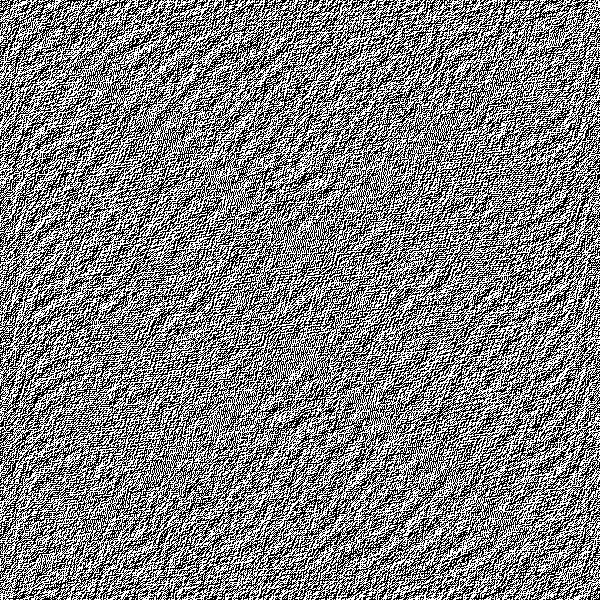
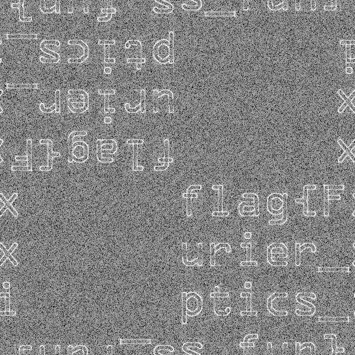

# Hackergame2020 来自一教的图片 WP

## 题目简述

题目给出一张名为 `4f_system_middle.bmp` 的灰度图，画面只有密集的黑白纹理，并提示它来自傅里叶光学模拟。文件名中的 “4F 系统中间平面” 指向傅里叶变换平面：图像并非普通照片，而是把空间域信息编码到了二维频域中。

本题的决定性步骤是从有意隐藏信息的图像载体中恢复 flag，因此归入隐写方向。

## 解题过程

原始载体肉眼看起来只有高频纹理，直接调亮度、对比度或检查最低有效位都不会得到连贯文本。



对大小为 $M\times N$ 的图像 $f(x,y)$ 做二维离散傅里叶变换：

$$
F(u,v)=\sum_{x=0}^{M-1}\sum_{y=0}^{N-1}f(x,y)e^{-2\pi i(ux/M+vy/N)}.
$$

题目图像保存的是原图傅里叶变换的实部。再次做二维 FFT 后，空间域文字会以周期延拓、中心反演和共轭对称造成的镜像形式出现。变换结果的动态范围很大，需要取模并使用 $\log(1+|F|)$ 压缩；否则少数极大的频率分量会淹没文字。

```python
from pathlib import Path

import numpy as np
from PIL import Image

src = Path("4f_system_middle.bmp")
img = np.asarray(Image.open(src).convert("L"), dtype=np.float64)

freq = np.fft.fft2(img)
view = np.log1p(np.abs(freq))

# 用百分位裁剪抑制极端亮点，再归一化到 8 位灰度。
low, high = np.percentile(view, (1.0, 99.9))
view = np.clip((view - low) / (high - low), 0.0, 1.0)
Image.fromarray((view * 255).astype(np.uint8)).save("fft-recovered-flag.png")
```

恢复图中的字符串跨越周期边界，并伴有旋转、镜像副本。沿左上、中央和右下的连续字符读取，可拼出完整结果。



最终得到：

```text
flag{Fxurier_xptics_is_fun}
```

## 方法总结

题面中的傅里叶光学和 `4f_system_middle` 都是强提示。处理频域隐写时，应分别观察实部、虚部、幅度和相位，并注意 `fftshift`、中心反演及周期边界带来的位置变化。本题真正影响可读性的不是复杂密码，而是频域结果巨大的动态范围；取模后做对数拉伸即可稳定显出文字。
