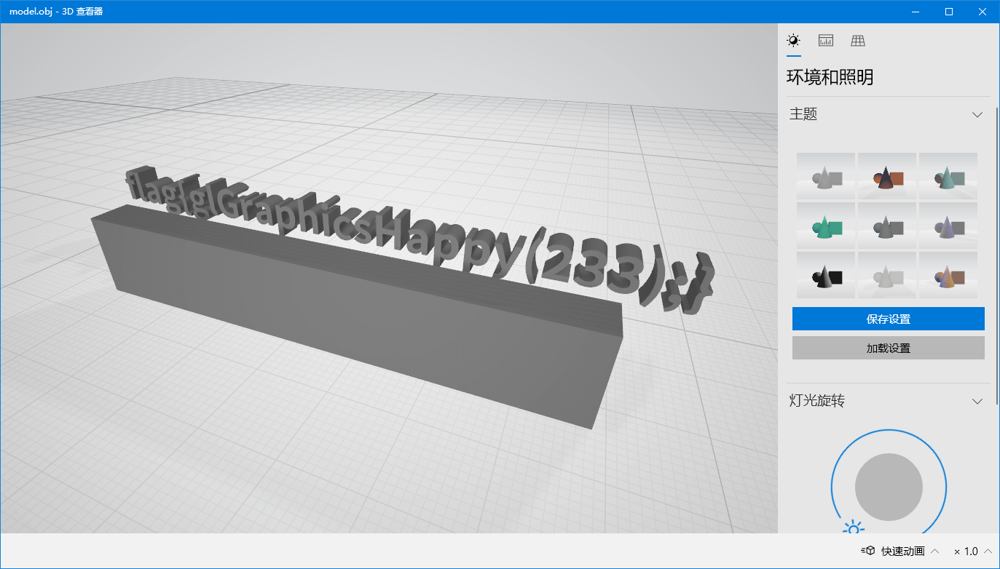
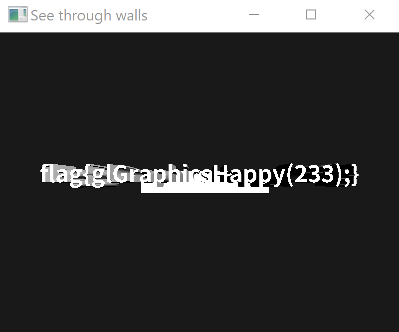

# Hackergame2020 超简陋的 OpenGL 小程序 WP

## 题目简述

附件是一个基于 OpenGL 的小程序。运行后只能看到一块被光照的实体，题面却提示“有什么被挡住了”。模型数据存放在 `data.bin` 中，里面的顶点和索引实际构成了 flag 字样与一块位于其前方的遮挡物。

目标不是破解字符串编码，而是识别三维场景中被刻意遮挡的载荷并改变观察或渲染方式，因此归入隐写方向。

## 解题过程

### 从网格确认隐藏内容

图形调试器 RenderDoc 可以截获一帧中的 OpenGL 调用。在捕获帧里选择相应 draw call，再打开 Pipeline 的 Mesh View，就能绕过最终画面的深度遮挡，直接查看顶点组成的几何体。也可以按照题目源码中的二进制格式导出 `data.bin`，再用三维查看器检查模型。



这一步说明 flag 本来就在模型中，只是正常相机下先通过深度测试的墙体挡住了它。

### 修改片段着色器

另一种更直接的办法是把模型原始坐标传到片段着色器，并丢弃遮挡物所在一侧的片段。顶点着色器增加输出：

```glsl
out vec3 OrigPos;

void main()
{
    FragPos = vec3(model * vec4(aPos, 1.0));
    Normal = aNormal;
    OrigPos = aPos;
    gl_Position = projection * view * vec4(FragPos, 1.0);
}
```

片段着色器接收原始坐标，在输出颜色前执行裁剪：

```glsl
in vec3 OrigPos;

void main()
{
    // 省略原有的环境光和漫反射计算。
    if (OrigPos.z > 0.0)
        discard;

    FragColor = vec4(result, 1.0);
}
```

阈值的正负取决于模型坐标方向；核心是让挡板不再写入颜色和深度缓冲。重新编译运行后，文字模型直接可见。



得到：

```text
flag{glGraphicsHappy(233);}
```

## 方法总结

三维题首先要区分“内容不存在”和“内容被渲染状态隐藏”。Mesh View 能直接检查几何输入，修改相机、模型矩阵、深度测试或片段着色器都能绕过遮挡。本题最短路径是抓帧看网格，最容易复现的路径则是在 shader 中按原始坐标 `discard` 掉挡板。
