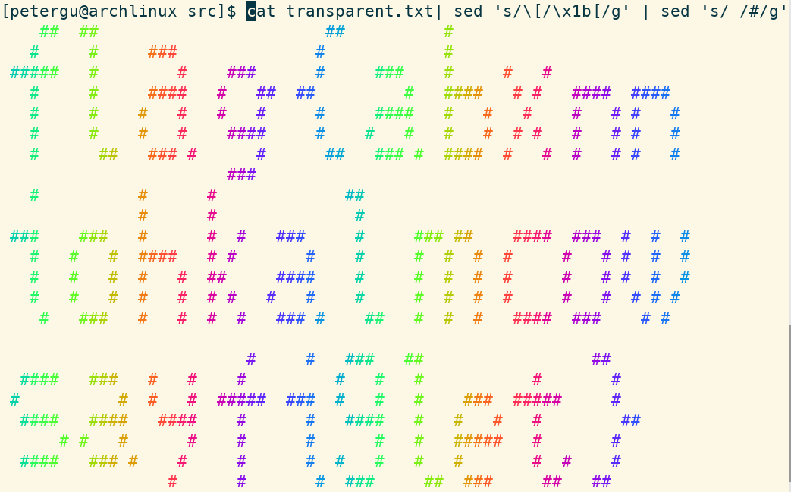

# 透明的文件

## 题目简述

附件看起来几乎是空白文本，实际包含大量 VT100/ANSI 控制序列。题目故意删掉了每条 CSI（Control Sequence Introducer）前的 ESC 字节 `0x1b`，使终端把控制命令当普通字符；补回 ESC 后，光标移动和颜色控制会把离散字符重新排成图案。

## 解题过程

CSI 的常见完整形式是 `ESC [`，即字节序列 `1b 5b`。附件保留了 `[` 及其后的参数，因此只需在每个 `[` 前插入 ESC。为让原本的空格也参与成图，再将空格替换为可见字符：

```bash
sed 's/\[/\x1b[/g' transparent.txt | sed 's/ /#/g'
```

也可以用 Python 生成同样的字节流：

```python
data = open("transparent.txt", "rb").read()
data = data.replace(b"[", b"\x1b[").replace(b" ", b"#")
open("render.bin", "wb").write(data)
```

把 `render.bin` 输出到支持 ANSI 控制序列的终端，光标会按控制命令重新定位，形成彩色的大字：



按题面提示把图案中的字母按小写读取，得到：

```text
flag{abxnniohkalmcowsayfiglet}
```

## 方法总结

- 核心技巧：识别残缺的 ANSI CSI 序列，补回 `0x1b` 后让终端执行光标定位与着色。
- 识别信号：文本中密集出现形如 `[12;34H`、`[31m` 的片段，而直接查看内容几乎为空或杂乱。
- 复用要点：控制序列是字节级协议，不能只看渲染后的文本；重放不可信控制字符应在隔离终端中进行，避免终端状态被意外修改。
