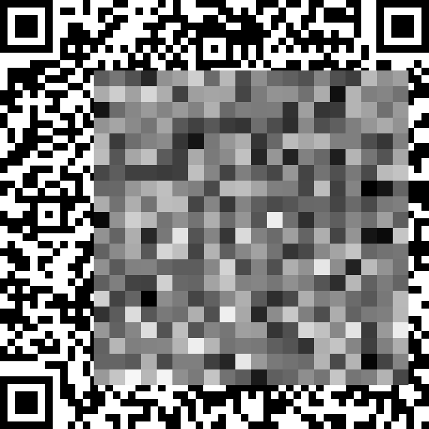

# 马赛克

## 题目简述

附件是一张部分区域被灰度马赛克覆盖的二维码。二维码每个逻辑模块为 $11\times11$ 像素，马赛克区域左上角为 $(103,137)$，由 $20\times20$ 个边长 23 像素的马赛克块组成。马赛克颜色不是随机值，而是原区域像素灰度均值取整，因此每一块都泄露了它覆盖的黑白二维码模块的面积加权和。



## 解题过程

### 建立约束

二维码模块只能取黑、白两种值，可记为 $0$ 和 $255$。一个 $23\times23$ 马赛克块最多跨越 $3\times3$ 个二维码模块，因此最多只有 9 个未知布尔量，穷举上限为 $2^9=512$。

对某个马赛克块，先计算它与各二维码模块的重叠面积 $a_i$。若模块颜色为 $c_i\in\{0,255\}$，题目生成的灰度满足：

$$
m=\left\lfloor\frac{\sum_i a_i c_i}{23^2}\right\rfloor
$$

枚举未知模块的所有黑白组合，只保留计算结果等于当前马赛克灰度 $m$ 的方案。

### 迭代传播

马赛克区域之外的模块可直接从原图读出，用它们作为初始已知值。对每个马赛克块执行以下过程：

```python
from itertools import product

def solve_block(overlaps, known, observed):
    """overlaps: [(module_id, overlap_area), ...]"""
    unknown = [mid for mid, _ in overlaps if mid not in known]
    candidates = []

    for bits in product((0, 255), repeat=len(unknown)):
        trial = dict(zip(unknown, bits))
        total = 0
        for mid, area in overlaps:
            total += area * (known[mid] if mid in known else trial[mid])
        if total // (23 * 23) == observed:
            candidates.append(trial)

    # 所有候选中取值都相同的模块可以被确定
    fixed = {}
    for mid in unknown:
        values = {candidate[mid] for candidate in candidates}
        if len(values) == 1:
            fixed[mid] = values.pop()
    return fixed
```

反复遍历全部 400 个马赛克块，把唯一解或所有候选的公共位写回已知集合；新确定的模块又会缩小相邻块的搜索空间。迭代到不再产生新模块时，将已知黑白值填回二维码。即使仍有少量未知模块，QR 自带的 Reed-Solomon 纠错也足以恢复内容。

扫码得到：

```text
flag{QRcodes_are_pixel_arts_EvSwCSAWtP}
```

## 方法总结

- 核心技巧：把均值马赛克视为面积加权的离散约束，对每块至多 9 个二维码模块枚举并迭代传播。
- 识别信号：底图是规则黑白网格，马赛克块与网格不对齐，且每块颜色来自均值而非随机覆盖。
- 复用要点：先精确测量网格尺寸、马赛克原点和块大小；只有唯一值或所有候选的公共位才能写回，最后再利用载体自身的纠错能力。
