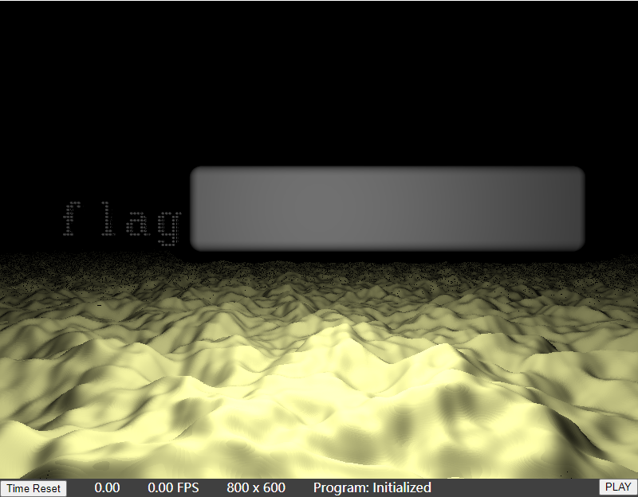
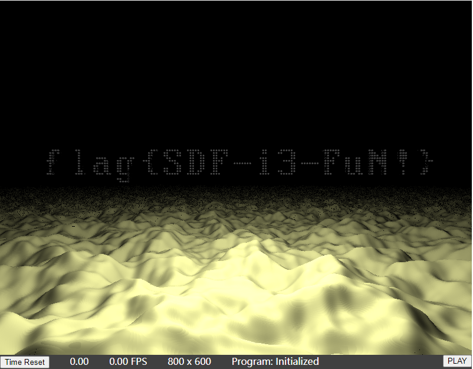

# 光与影

## 题目简述

网页用 WebGL 片段着色器渲染一片崎岖地形。远处只能看到 `flag` 开头，后半部分被一个长方体遮住。目标是检查场景的 SDF 组合方式，移除遮挡物后读出完整文字。

决定性步骤是从三维场景中显现被有意遮挡的载荷，故归入隐写方向；Shader 代码分析是定位遮挡物的手段。

## 解题过程

原始场景如下。左侧只能看到开头，灰色长方体正好挡住后续字符：



网页没有下载额外模型，真正的场景几何全部写在 `fragment-shader.js` 中。片段着色器使用有向距离场（SDF）和 Ray Marching：`t1SDF` 至 `t4SDF` 由许多小球的并集拼出文字，`t5SDF` 则定义一个圆角长方体。

`sceneSDF` 用 `min` 求多个 SDF 的并集：

```glsl
float t1 = t1SDF(pTO.xyz);
float t2 = t2SDF((mk_trans(-45.0, 0.0, 0.0) * pTO).xyz);
float t3 = t3SDF((mk_trans(-80.0, 0.0, 0.0) * pTO).xyz);
float t4 = t4SDF((mk_trans(-106.0, 0.0, 0.0) * pTO).xyz);
float t5 = t5SDF(p - vec3(36.0, 10.0, 15.0),
                 vec3(30.0, 5.0, 5.0), 2.0);

float tmin = min(min(min(min(t1, t2), t3), t4), t5);
```

这里 `t5` 的位置和尺寸正对应画面中的遮挡长方体。把最后一行改成只合并四段文字：

```glsl
float tmin = min(min(min(t1, t2), t3), t4);
```

保存脚本并重新加载页面，等待浏览器重新编译 Shader。长方体不再属于场景 SDF，Ray Marching 会直接命中文字球体，完整 flag 随之显现：



无需理解每个字符对应的超长球体坐标，也不必修改相机、灯光或地形。只要比较各 SDF 的几何作用，排除唯一的大型遮挡物即可。

## 方法总结

阅读程序化渲染题时，应从“场景由哪些几何体组成”入手，而不是被片段着色器的长度吓住。SDF 中 `min` 常表示并集、`max` 常参与交集或差集；找到异常几何体并从组合表达式中移除，就能改变最终可见性。本题真正有用的视觉证据是修改前后的场景对照，因此两张渲染图被保留并使用语义化文件名。
