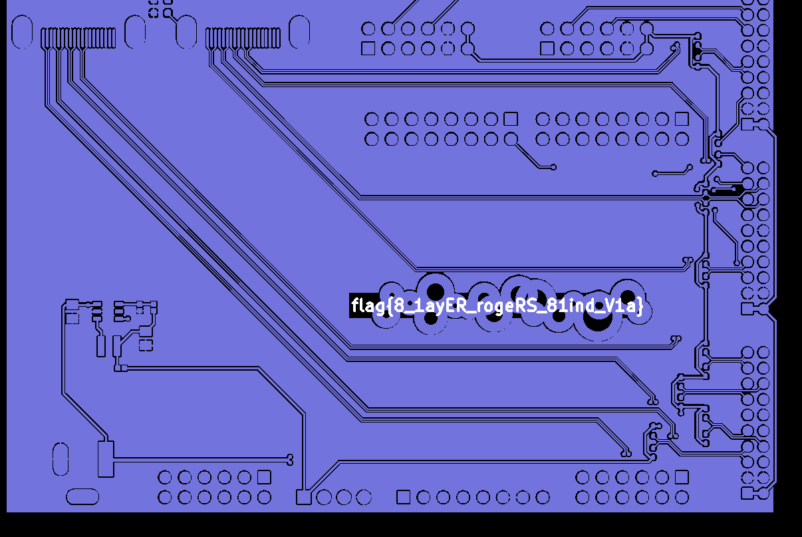

# 线路板

## 题目简述

题目给出一组 PCB 生产文件。实物照片上只能看到不完整的 `flag` 字样，需要从生产文件中还原被焊盘、过孔等图形遮挡的完整内容。

附件不是 PCB 工程源文件，而是交付工厂生产时常用的 Gerber 与钻孔文件。Gerber 文件分别描述铜层、丝印、板框等二维几何图形；它们不保存元器件语义，但完整保留了各层实际要制造的形状。本题的关键不是分析电路功能，而是在正确的图层中找到被有意藏入几何图形的文字，因此归入隐写方向。

## 解题过程

解压附件后，可以看到若干 `.gbr` 文件和一个 `.drl` 钻孔文件。其中 `ebaz_sdr-F_Cu.gbr` 表示正面铜层。用 KiCad Gerber Viewer、gerbv 等 Gerber 查看器载入全部生产文件，再重点查看正面铜层。

直接浏览整块板时，文字与周围焊盘、过孔混在一起，辨识度很低。用鼠标框选疑似 `flag` 的区域后，查看器会高亮属于该层的几何对象，从而把文字轮廓与背景分离。高亮后的结果如下：

由高亮轮廓即可逐字读出 flag。flag 的正文还对应了题目所暗示的 PCB 工艺：八层板、Rogers 高频板材和盲孔。

附件中不同文件的作用也可以据此确认：

- `F_Cu`、`B_Cu` 分别是正面和背面铜层；
- `F_Silkscreen`、`B_Silkscreen` 是正反面丝印；
- `Edge_Cuts` 描述板框；
- `PTH.drl` 记录镀铜孔的位置。

官方题解里的下单网页和群聊截图只是在说明 Gerber 可以直接用于生产，并不参与解题，故没有保留为图片。

## 方法总结

遇到 PCB 生产文件时，应先根据扩展名和文件名判断图层用途，再用专用查看器叠加或单独查看各层。本题的决定性步骤是选择正面铜层并高亮目标区域，使隐藏在复杂几何结构中的文字显现。对于这类附件，不必先逆向电路功能；Gerber 本身就是最接近最终制造图形的证据。
