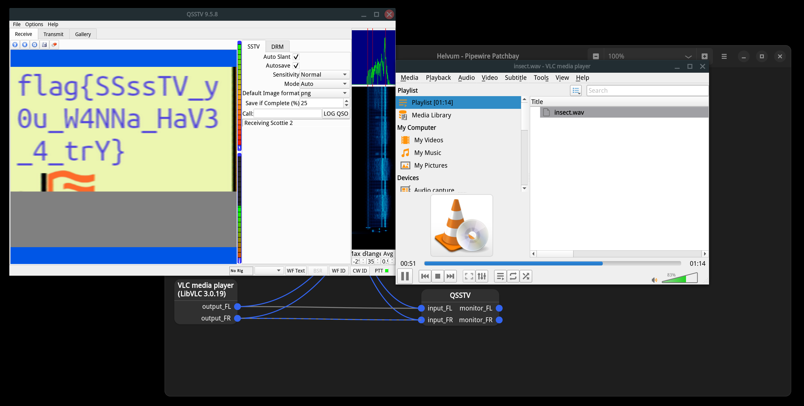

# 虫

## 题目简述

附件 `insect.wav` 听起来像周期变化的“虫鸣”，实际承载的是慢扫描电视（SSTV）信号。目标是把音频送入 SSTV 解码器，恢复隐藏图像并读取其中的 flag。

## 解题过程

先确认附件只是普通可播放的 PCM WAV：单声道、16 位采样、采样率 22050 Hz、时长约 74.248 秒。持续约一分钟的调制音以及开头的校准信号符合 SSTV 通过音频逐行传图的特征。

使用 QSSTV 解码时，可以按以下流程操作：

1. 打开 QSSTV 的接收页面，启用 `Auto Slant`，模式保持自动识别；若图像倾斜，再调整该选项和灵敏度。
2. 用 VLC 等播放器播放 `insect.wav`，不要把声音经过麦克风和扬声器进行二次采集。
3. 在 PipeWire/PulseAudio 的连接界面中，把播放器输出直接连接到 QSSTV 输入；Windows 上也可使用已有的虚拟音频线完成同样的内部回环。
4. 从音频开头开始完整播放。QSSTV 识别头部后会显示 `Receiving Scottie 2`，随后逐行恢复图像。

解码画面中的文字为：

```text
flag{SSsTV_y0u_W4NNa_HaV3_4_trY}
```



如果只得到错位或斜切图像，应先确认从 WAV 起点播放、播放器没有变速或重采样，再检查 QSSTV 是否识别到模式头；盲目调整图像通常不如先修正音频路由可靠。

## 方法总结

本题虽然借用了无线电图像传输格式，但给定材料是离线 WAV，决定性步骤是从音频中提取有意隐藏的图像载荷，因此归类为 Stego，而不是 Hardware。识别这类题时可结合声音形态、持续时间和校准段判断调制格式；解码时应优先使用无损的数字音频回环，避免扬声器到麦克风链路引入噪声、自动增益和时钟漂移。
