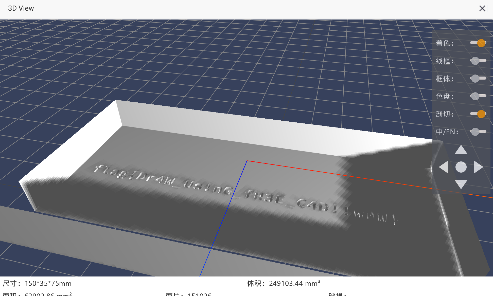

# 打不开的盒

## 题目简述

附件是一个密封盒子的 STL 三维模型。盒子外壳只能透出少量内部结构，flag 实际以立体文字的形式封在模型内部。关键不是打印并破坏实体，而是利用 3D 查看器的剖切、裁剪平面、隐藏网格或进入模型内部的视角来观察隐藏几何体。

## 解题过程

将 STL 导入支持截面查看的 3D 工具，例如切片软件、在线 3D 打印预览器或 macOS 自带模型预览器。

若工具支持剖切，沿盒子长边移动裁剪平面，去掉上盖和侧壁；若没有剖切功能，则关闭外壳网格、把相机放大穿过表面，或切换到线框模式。内部底面上的凸起文字会直接显露：

旋转模型，使视线尽量垂直于文字平面，再逐字符读取并提交。整个过程只改变查看方式，不需要修改 STL、进行实体打印或尝试破解某种文件加密。

## 方法总结

- 核心技巧：对三维模型使用剖切、隐藏表面或穿模视角，观察封闭体内部的隐藏几何信息。
- 识别信号：STL 外壳封闭但存在镂空，内部隐约可见独立结构，题面反复强调“密封”和“砸开”。
- 复用要点：3D 载体题先检查模型层级、法线、线框和截面，不要受“必须打印”的叙事限制；保留截图时应呈现空间关系，而不是只截最终文本。
