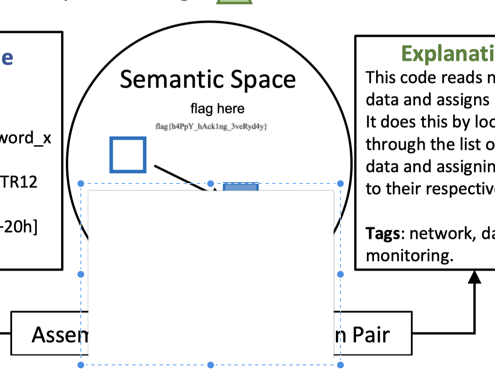

# 每日论文太多了！

## 题目简述

题目指向 ACM 论文 DOI `10.1145/3650212.3652145`。PDF 第 6 页中存在可搜索到的字符串 `flag here`，但相应区域被一个白色图片对象覆盖；flag 并未加密，而是作为另一个图像对象留在 PDF 的对象层中。决定性障碍是 PDF 对象叠放造成的视觉隐藏。

## 解题过程

先下载论文 PDF，在阅读器中搜索 `flag`，定位到第 6 页。用 Inkscape、Adobe Acrobat、PDF Expert 等能编辑 PDF 对象的工具打开该页，选中并移走覆盖图示下半部分的白色矩形，即可看到被遮住的文字：



如果不使用图形编辑器，也可以直接提取 PDF 内嵌图片：

```bash
pdfimages 3650212.3652145.pdf prefix
```

逐个检查导出的图像时，`prefix-049` 包含隐藏文本。恢复结果为：

```text
flag{h4PpY_hAck1ng_3veRyd4y}
```

`pdftotext` 或全文搜索可用于快速发现 `flag here` 这个定位锚点，但真正的 flag 位于图像对象中，不能只依赖普通文本抽取。

## 方法总结

- 核心技巧：检查 PDF 页面对象的叠放关系，或用 `pdfimages` 绕过渲染层直接导出内嵌图片。
- 识别信号：可搜索文本指向某页，但正常渲染中对应位置没有结果；页面上存在与背景同色的覆盖对象。
- 复用要点：PDF 是由文本、矢量图形和位图等对象组合而成的容器。遇到视觉遮挡时，应分别尝试对象编辑、文本抽取和图片提取，而不是只看最终渲染画面。
