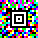

# L3akCTF 2024 Aztecs Writeup

## 题目简述

题目只给出一张 $50\times50$ 的彩色方块图。图案中央有 Aztec Code 特有的同心方形定位标记，但红、绿、蓝三种颜色叠在一起，直接交给条码解码器通常无法识别。



关键并不是修复一个损坏的条码，而是意识到 RGB 三个颜色通道分别承载了一张二值 Aztec Code；三段解码结果按通道顺序拼接后才是完整 flag。

## 解题过程

对每个颜色通道分别取值。官方生成方式令对应通道为 $0$ 的位置表示黑色，其余位置表示白色，因此可以直接把 R、G、B 三个通道各自阈值化：

```python
from PIL import Image

def split_channel(path, channel_index):
    src = Image.open(path).convert("RGB")
    out = Image.new("1", src.size)

    for y in range(src.height):
        for x in range(src.width):
            pixel = src.getpixel((x, y))
            out.putpixel((x, y), 0 if pixel[channel_index] == 0 else 1)

    return out

codes = [split_channel("challenge.png", i) for i in range(3)]
for i, code in enumerate(codes):
    code.save(f"channel-{i}.png")
```

分别用 ZXing 或 zxing-cpp 这类明确支持 Aztec Code 的本地解码器读取三张黑白图。每张图给出 flag 的一段，按照 R、G、B 的顺序连接：

```python
flag = red_part + green_part + blue_part
print(flag)
```

得到：

```text
L3AK{d0_YOu_r34L1y_ThINk_7H3_aNCi3n7_4z7Ec5_kn3W_B4rc0De5}
```

## 方法总结

- 彩色二维条码不一定只是在黑白码上加装饰；应先检查各颜色通道是否分别形成完整定位结构。
- 本题的隐藏层次是“RGB 通道拆分 → 三张二值 Aztec Code → 解码并按通道顺序拼接”。
- 原始叠加图包含决定性视觉信息，值得保留；拆分和阈值化代码则应写成文本，没必要保留代码截图或在线解码器页面截图。
