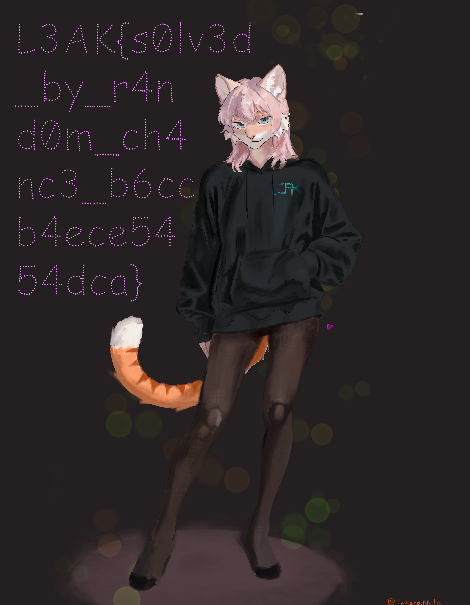

# L3akCTF 2025 Puzzles 5 Writeup

## 题目简述

Puzzles 5 的最终图片被切成 $128\times128$，共 16384 块，答题时限只有 5 秒。即使已经具备前几关的图像匹配器，也无法在远端时限内完成如此大规模的比较。

源码揭示每个用户拥有一个独立的 Go `math/rand.Rand`：

```go
u := &User{
    RNG: rand.New(
        rand.NewSource(
            int64(binary.BigEndian.Uint64(userID[4:])),
        ),
    ),
}
```

`userID` 来自安全随机字节，但经典 `math/rand` 的 `Seed` 会把种子折叠到模 $2^{31}-1$ 的状态类。只要从一次已知洗牌中恢复该 31 位等价种子，就能预测后续所有拼图的正确排列，在 5 秒内直接提交最终答案，再按预测顺序重建藏有 flag 的图片。

弱 PRNG 是取得顺序的关键辅助原语，但最终 flag 只存在于重建后的图像空间布局中，而不在 API 奖励里，因此本文归入 stego。

## 解题过程

### 确认 API 奖励是诱饵

完成 $128\times128$ 关卡后，`/api/getflag` 返回的是 Puzzles 4 的字符串：

```text
L3AK{4_0rig1n4lly_i_pl4nned_th1s_70_b3_4_d3coy_fl4g_l0l_4nyw4y5_g0_s0lv3_th3_puzzl3}
```

真正的 Puzzles 5 flag 被画在 `level5/l3ak_catgirl.png` 中。必须保存最后一次 `/api/newpuzzle` 返回的 16384 个 Base64 PNG 块，并把它们按正确位置重新粘贴。

### 从第一张拼图恢复洗牌随机数

创建账号时，程序先用同一个 RNG 打乱五关的图片顺序。各关图片数量是：

```text
10, 10, 10, 1, 1
```

这一步一共执行 $10+10+10+1+1=32$ 次 `Intn`。随后第一张 $4\times4$ 拼图又执行 16 次 Fisher–Yates：

```go
for i := range shuffled {
    j := u.RNG.Intn(i + 1)
    shuffled[i], shuffled[j] = shuffled[j], shuffled[i]
}
```

先用 Puzzles 1 的图像方法解出第一张图，得到服务要求的 `answer`。它是“原始位置到返回位置”的逆置换，需要先还原成服务端洗牌后的原始编号列表：

```go
func inversePermutation(order []int) []int {
    inverse := make([]int, len(order))
    for original, current := range order {
        inverse[current] = original
    }
    return inverse
}
```

再逆向 Fisher–Yates。对于 $i=n-1,n-2,\ldots,0$，元素 $i$ 当前所在的位置就是当轮使用的交换位置 $j_i$；记录它并把交换撤销：

```go
func invertFisherYates(shuffled []int) []int {
    choices := make([]int, len(shuffled))

    for i := len(shuffled) - 1; i >= 0; i-- {
        swapPosition := slices.Index(shuffled, i)
        choices[i] = swapPosition
        shuffled[i], shuffled[swapPosition] =
            shuffled[swapPosition], shuffled[i]
    }
    return choices
}
```

这样便得到第一张拼图使用的 16 个 `Intn(i+1)` 结果。

### 穷举 31 位等价种子

Go 1.23 的旧式 `math/rand` 源在播种时按 $2^{31}-1$ 归约；官方说明中把它简写成“只使用低 32 位”并不精确。真正需要搜索的是至多 $2^{31}-1$ 个等价状态。

对每个候选种子：

1. 精确重放创建账号时五次图片列表洗牌；
2. 生成第一张图的 16 个 Fisher–Yates 选择；
3. 与逆向得到的 `choices` 比较；
4. 任一位置不同就立即放弃该种子。

```go
func matches(seed int64, target []int) bool {
    rng := rand.New(rand.NewSource(seed))

    for _, count := range []int{10, 10, 10, 1, 1} {
        for i := 0; i < count; i++ {
            rng.Intn(i + 1)
        }
    }

    for i, expected := range target {
        if rng.Intn(i + 1) != expected {
            return false
        }
    }
    return true
}
```

绝大多数候选在前一两个选择就会失败，使用 16 个 goroutine 分段搜索大约数分钟即可命中。找到种子后，应从头初始化 RNG 并严格重放所有调用，不能直接沿用穷举过程中的临时状态。

### 预测剩余关卡

第一张拼图提交成功后，服务还会随机选择一条胜利消息，这会额外调用一次 `Intn`。此后每张拼图的 RNG 消耗顺序为：

1. 对全部图片块执行 `N` 次 Fisher–Yates；
2. 正确提交后，为胜利消息执行一次 `Intn`。

生成服务所需逆置换的函数如下：

```go
func generateAnswer(length int, rng *rand.Rand) []int {
    shuffled := make([]int, length)
    for i := range shuffled {
        shuffled[i] = i
    }

    for i := range shuffled {
        j := rng.Intn(i + 1)
        shuffled[i], shuffled[j] = shuffled[j], shuffled[i]
    }

    answer := make([]int, length)
    for current, original := range shuffled {
        answer[original] = current
    }
    return answer
}
```

重放第一张拼图和胜利消息后，依次请求并预测：

```text
第一关剩余 9 张
第二关 10 张
第三关 10 张
第四关 1 张
第五关 1 张
```

每次以 API 返回的 `rows * cols` 作为 `length`，生成答案后立即提交。最后一关虽然有 16384 块，但预测置换只需线性时间，能够满足 5 秒限制。

### 重建最终图片

保存最后一关响应中的：

```text
pieces     16384 个 Base64 PNG
answer     原始位置 -> pieces 索引
```

按行优先位置粘贴即可：

```python
import base64
import io
import json

from PIL import Image

pieces = json.load(open("level5_data.json", encoding="utf-8"))
answer = json.load(open("level5_order.json", encoding="utf-8"))

cols = rows = 128
tile_width = 27
tile_height = 35
canvas = Image.new(
    "RGBA",
    (cols * tile_width, rows * tile_height),
)

for original_position, received_index in enumerate(answer):
    raw = base64.b64decode(pieces[received_index])
    tile = Image.open(io.BytesIO(raw))
    x = original_position % cols
    y = original_position // cols
    canvas.paste(
        tile,
        (x * tile_width, y * tile_height),
        tile if tile.mode == "RGBA" else None,
    )

canvas.save("rebuilt.png")
```

重建后可直接在图片左侧读到分行书写的 flag。下面保留的是仓库中的原始画面，其主体与远端重建结果一致；图片包含真正的视觉证据，因此没有转写后删除。



最终 flag 为：

```text
L3AK{s0lv3d_by_r4nd0m_ch4nc3_b6ccb4ece5454dca}
```

## 方法总结

本题不能把安全随机生成的 64 位输入直接等同于安全 PRNG 状态。`crypto/rand` 只负责产生初始字节，随后交给旧式 `math/rand` 后，种子被压缩到约 31 位等价空间；一次已知 Fisher–Yates 置换就足以高效筛选种子。

完整利用依赖严格的随机调用记账：账号初始化、每张拼图洗牌和胜利消息都共享同一 RNG，漏算一次调用就会让后续 16384 项预测完全错位。预测出排列后仍需保存原始 PNG 块并按“原始位置到返回索引”的方向重建，才能取得只存在于图像中的真实 flag。
