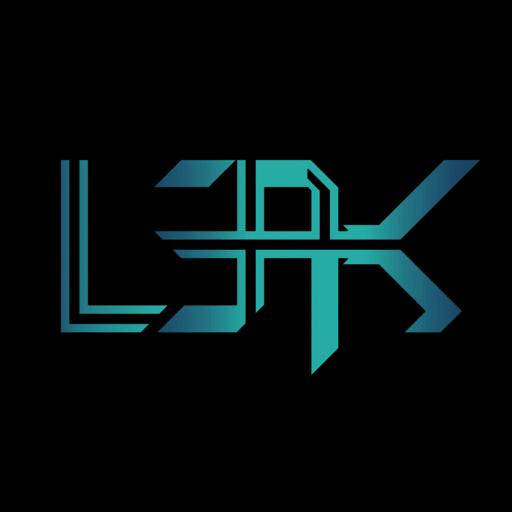

# L3akCTF 2025 Quantam Exfil Writeup

## 题目简述

题目给出两张 JPEG：原始封面 `original.jpg` 和疑似泄露数据的 `exfil.jpg`。肉眼观察时，两张图片都呈现黑色背景上的蓝色 L3AK 标志，几乎没有可见差异。




秘密信息被写入 JPEG 非零 AC DCT 系数的奇偶位，决定性障碍是定位隐藏信道并按状态化置换恢复载荷，因此本文按 Stego 归档。仓库目录名中的 `quantam` 是题目原名，本文保留该拼写。

## 解题过程

### 从两张 JPEG 提取奇偶位

不能先把图片解码成像素再比较，因为重新量化会丢失题目利用的 DCT 系数。原生辅助模块会直接读取两张 JPEG 的量化表和各颜色分量的有符号 16 位 DCT 系数。

首先由原图的两张量化表建立 64 字节初始状态：

```javascript
initState = SHA512(quantTable0 || quantTable1)
```

随后按颜色分量、8×8 块、zigzag 位置的顺序扫描。跳过 DC 系数 `zz = 0`，并只保留原图中系数非零的位置；对应隐写图系数的绝对值最低位就是一个载荷 bit：

```javascript
for (let component = 0; component < host.length; component++) {
  for (let block = 0; block < blockCount; block++) {
    for (let zz = 1; zz < 64; zz++) {
      const original = hostCoef(component, block, zz);
      if (Math.abs(original) !== 0) {
        const changed = stegCoef(component, block, zz);
        parity.push(Math.abs(changed) & 1);
      }
    }
  }
}
```

以原图判断“可用槽位”很重要。隐写时系数可能因调整奇偶而变成零；若改用隐写图筛选槽位，后续 bit 会整体错位。

### 恢复槽位置换和密文块

使用 `initState[32:48]` 初始化 xorshift128+，对全部槽位索引做 Fisher–Yates 洗牌，再按洗牌后的索引读取 `parity`。每 128 bit 组成一个 16 字节密文块，位序为高位在前：

```javascript
const bits = shuffledSlots.map(i => parity[i]);

for (let i = 0; i < 16; i++) {
  for (let k = 0; k < 8; k++) {
    byte = (byte << 1) | bits[offset + i * 8 + k];
  }
}
```

同一个 xorshift128+ 还用于后面的 S 盒和 P 盒生成。种子按两个小端 64 位整数读取，并在每轮更新后截断为 64 位；BigInt 位移若不加掩码，会与原实现产生不同序列。

### 逐块逆转状态化加密

每个 16 字节块都使用当前 64 字节 `state` 动态生成：

- `state[0:16]` 生成 256 项字节 S 盒；
- `state[16:32]` 生成 128 项 bit 置换 P 盒。

解密顺序为：

1. 密文块与 `state[0:16]` 异或；
2. 按逆 P 盒还原 128 个 bit；
3. 每 8 bit 组成字节，再查逆 S 盒。

```javascript
afterXor[i] = cipherBlock[i] ^ state[i];
originalBits[i] = permutedBits[inversePBox[i]];
plainBlock[i] = inverseSBox[rebuiltByte];
```

每解出一块，状态更新为：

```text
state = SHA512(state || plaintext_block)
```

第一明文块的前 4 字节是大端载荷长度 $L$。需要读取的总明文长度为：

$$
\operatorname{padded}=((4+L+15)\mathbin{\&}\sim15)
$$

取完整明文的 `[4:4+L]` 并按 UTF-8 解码，得到：

```text
L3AK{1f_1_w45_4n_4p7_1_w0uld_3xf1l_4ll_pwn3d_d474_u51n6_57364n06r4phy_frfr_4d7184b2c38f91f}
```

## 方法总结

本题利用的是 JPEG 编码域，而不是可见像素域。两张图的视觉相似性只能说明修改足够隐蔽；真正的证据是同一位置 DCT AC 系数的奇偶变化。原图同时决定可用槽位和初始状态，因此它不是可有可无的对照图。

完整载荷还经过全局槽位置换和逐块状态化加密。任一处顺序错误都会让之后所有块失效：应固定颜色分量、块、zigzag、bit 的遍历顺序，并在每块解密后立即更新状态。首块中的显式长度则提供了可靠的停止条件，避免把剩余载体噪声误当成密文。
