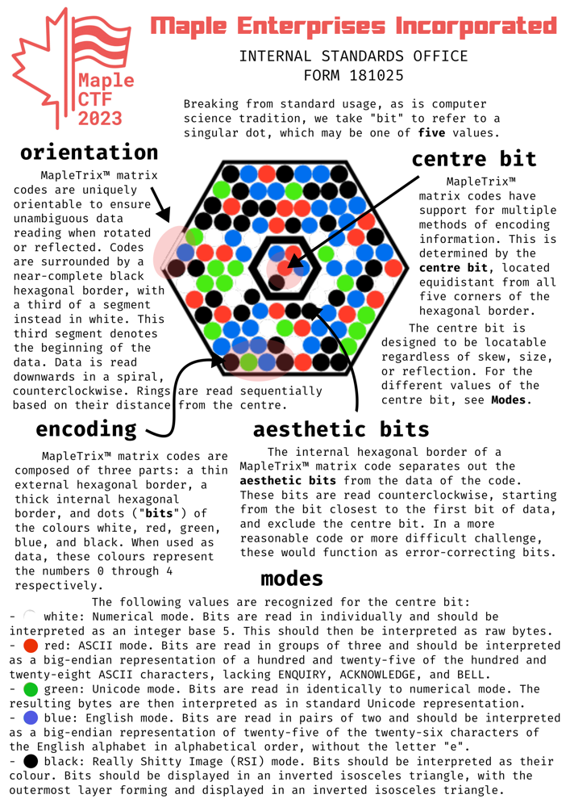

# madness

## 题目简述

服务依次展示 777 张彩色六边形点阵图，图片按文件名排序；每次必须提交图片编码的字符串，正确才进入下一张，全部通过后返回 flag。附件规范把这种图码称为 MapleTrix：颜色代表五进制数字，数据沿六边形同心环排列，方向由外框的一段白色标记确定。




## 解题过程

规范定义白、红、绿、蓝、黑依次表示五进制的 0、1、2、3、4。半径为 6 的六边形网格共有 127 个点；外侧半径 3 至 6 的四环分别含 18、24、30、36 个点，正好构成 108 个数据位。半径 1、2 的 18 个点只是美化信息，中心点决定编码模式。

先检测圆点中心并按最近颜色量化，再根据外框白色线段把图像旋转或镜像到统一方向。按规范从外环向内环、从下方起点沿逆时针螺旋读取 108 个五进制数字。中心模式的主要解释规则为：

- 白色：整段五进制数转为字节；
- 红色：每三个五进制数字转成一个 ASCII 字符；
- 绿色：五进制整数转字节后按 Unicode 解码；
- 蓝色：每两个五进制数字映射到去掉字母 `e` 的 25 字母表；
- 黑色：按规范给出的倒置等腰三角形 RSI 颜色模式显示。

仓库中 370 个文件名长度为 36，恰好对应红色模式的 $108/3$ 个字符；407 个文件名长度为 54，且均不含 `e`，对应蓝色模式的 $108/2$ 个字符。这同时提供了很强的离线自检：解码结果应与当前图片文件名完全相等。

完成单图解码器后，按服务返回顺序循环下载图片、识别方向与颜色、解码并提交文本。不要并发请求，因为服务以会话状态记录当前序号。连续通过 777 轮后得到：

```text
maple{C0D3_SC4NN1NG_L0RD}
```

## 方法总结

这类视觉编码题应先用几何计数验证规范：四个数据环合计 108 点，与两种文件名长度严丝合缝，比仅凭样图猜遍历顺序可靠。图像处理部分应分为定位、方向归一化、颜色量化和符号解释四层，并用附件文件名做单元测试。代码截图或文字规范可以转写，但方向标记、环结构和颜色布局具有不可替代的视觉信息，因此保留了规范页和一张样例。
