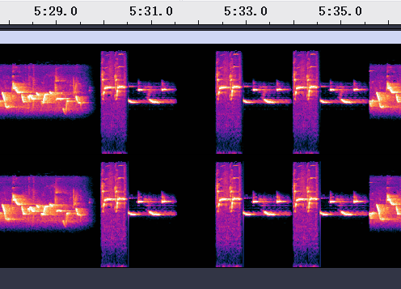

# As the birds say

## 题目简述

题目把一段信息编码进鸟鸣音频。音轨并不是频谱图文字，而是由三段固定鸟叫模板顺序拼接而成：短鸟鸣表示摩尔斯点 `.`，较长鸟鸣表示划 `-`，第三种鸟鸣表示字符分隔；额外的长静音表示英文单词边界。得到点划序列后还不能直接读出完整明文，因为主体使用的是和文摩尔斯电码（Wabun code），方括号内的英文片段则使用国际摩尔斯电码。

题目源码还给出了语言切换规则：日文段开始或从英文切回日文时插入 `DO`，从日文切到英文以及日文消息结束时插入 `SN`。因此解题主线是先恢复鸟鸣符号流，再按 `DO` / `SN` 标志在和文电码与国际摩尔斯电码之间切换。

## 解题过程

### 从鸟鸣恢复点划序列

生成器明确使用 `0.wav`、`1.wav`、`2.wav` 三个模板分别表示点、划和字符分隔，并用至少 $800\ \mathrm{ms}$ 的静音表示英文单词边界。频谱视图中也能看到固定形状的鸟鸣片段反复出现，以及片段之间明显不同的间隔：



解码器先把输入统一转成 $11025\ \mathrm{Hz}$ 单声道 PCM；由于题目音频经过 MP3 压缩，模板也先做一次相同的 MP3 往返转换，避免直接比较原始 WAV 时受到有损压缩误差影响。

在当前位置分别尝试三个模板，并在 $\pm 50$ 个采样点范围内微调对齐。相似度使用余弦相似度：

$$
\operatorname{cos}(a,b)=\frac{a\cdot b}{\lVert a\rVert_2\lVert b\rVert_2+10^{-12}}.
$$

核心匹配逻辑可收敛为：

```python
def cosine(a, b):
    return float(
        np.dot(a, b) /
        (np.linalg.norm(a) * np.linalg.norm(b) + 1e-12)
    )

while pos + min(template_lengths) <= len(audio):
    best_score, best_label, best_shift = -1.0, -1, 0
    for label, (template, length) in enumerate(zip(templates, template_lengths)):
        for shift in range(-50, 51):
            start = pos + shift
            if start < 0 or start + length > len(audio):
                continue
            score = cosine(audio[start:start + length], template)
            if score > best_score:
                best_score, best_label, best_shift = score, label, shift

    if best_score < 0.3:
        events.append("word-gap")
        pos += int(0.1 * 11025)
    else:
        events.append((".", "-", "separator")[best_label])
        pos += best_shift + template_lengths[best_label]
```

依次把标签 `0`、`1`、`2` 映射为点、划、字符分隔，并保留静音形成的单词间隔，即可得到完整摩尔斯序列。无需把这段很长的中间串永久抄入 WP；重要的验证信号是第一轮按摩尔斯字符查看时能读到 `DO`、`SN`、`MINIL` 和 `WABUN CODE IS SO USELESS`。

### 按语言标志解码

国际摩尔斯表无法解释的部分并不是损坏数据，而是日文片假名对应的和文电码。按生成器的状态机解析：

- `DO` 后进入和文电码；
- `SN` 后进入英文片段，或在消息末尾结束日文段；
- 英文片段按国际摩尔斯表解码，日文片段按 Wabun 表解码；
- 濁音和半濁音由基本假名后追加对应修饰符编码。

解出的日文指令翻译后含义如下：

1. flag 以 `miniL` 开头，内容放在花括号中；
2. 内容为 `wabun code is so useless`；
3. 单词之间使用下划线连接；
4. 第一个单词以大写字母开头；
5. 把其中的 `A`、`O`、`E`、`I` 分别替换为 `@`、`0`、`3`、`1`。

按这些规则变换得到：

```text
miniL{W@bun_c0d3_1s_s0_us3l3ss}
```

这个结果同时受到两层独立证据支持：恢复出的英文片段直接给出核心短语，题目随附的生成明文与生成器代码也给出了完全相同的替换规则。

## 方法总结

- 核心技巧：把重复出现的音频片段当作离散符号模板，通过对齐后的余弦相似度恢复点、划、字符分隔和静音边界，再解析混合的国际摩尔斯与和文电码。
- 识别信号：音频中只有少数固定且时长稳定的鸟鸣、某一种声音总出现在符号组之间、解码后出现 `DO` / `SN` 或少量可读英文，说明载荷更像符号音频而不是频谱隐写。
- 复用要点：对有损音频应让模板经历相同转码，并允许小范围滑动对齐；先保存原始边界信息，不要在第一步把长静音压掉。出现部分可读文本但主体乱码时，应检查是否存在字符集或电码表切换，而不是立即否定已经恢复出的符号流。
