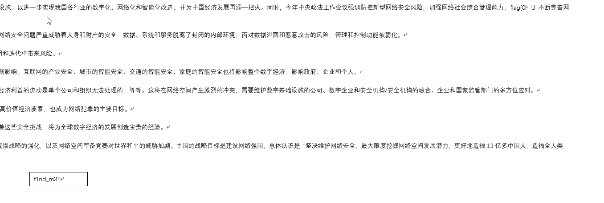

# Homework

## 题目简述

附件压缩包中是一份 Word 文档。正文表面看起来只是普通作业，实际使用两种版式技巧隐藏 flag：前半部分被设为白色并压缩到正常字宽的 1%，后半部分放在页面可视区域之外的文本框中。

这题既可以通过 Word 界面恢复，也可以直接分析 DOCX 内部的 XML。

## 解题过程

解压 `homework.zip` 得到 `诺亚的作业.docx`。在 Word 中全选正文，把字体颜色改为黑色，并在“字体—高级”中把字符缩放恢复为 100%，即可看到前半部分：

```text
flag{0h_U_
```

再切换到阅读版式或 Web 版式，原本位于页面外的文本框会进入可视区域，其中保存了后半部分：

```text
f1nd_m3!}
```



也可以不依赖 Word 界面。DOCX 本质上是 ZIP 容器，正文位于 `word/document.xml`。检查 XML 可以看到，前半部分被拆成多个文本运行，每个运行都含有白色字体属性 `<w:color w:val="FFFFFF"/>` 和 1% 字符缩放属性 `<w:w w:val="1"/>`；后半部分则位于 `<w:txbxContent>` 文本框节点中。

下面的脚本直接提取这两类内容：

```python
from xml.etree import ElementTree as ET
from zipfile import ZipFile

DOCX = "诺亚的作业.docx"
W_NS = "http://schemas.openxmlformats.org/wordprocessingml/2006/main"


def w_tag(name: str) -> str:
    return f"{{{W_NS}}}{name}"


with ZipFile(DOCX) as archive:
    document_xml = archive.read("word/document.xml")

root = ET.fromstring(document_xml)

hidden_parts = []
for run in root.iter(w_tag("r")):
    properties = run.find(w_tag("rPr"))
    text = "".join(node.text or "" for node in run.iter(w_tag("t")))
    if properties is None or not text:
        continue

    color = properties.find(w_tag("color"))
    width = properties.find(w_tag("w"))
    color_value = color.get(w_tag("val"), "").upper() if color is not None else ""
    width_value = width.get(w_tag("val"), "") if width is not None else ""

    if color_value == "FFFFFF" or width_value == "1":
        hidden_parts.append(text)

textbox_parts = []
for textbox in root.iter(w_tag("txbxContent")):
    text = "".join(node.text or "" for node in textbox.iter(w_tag("t")))
    # DrawingML 与兼容用的 VML 可能保存同一文本框，避免重复输出。
    if text and text not in textbox_parts:
        textbox_parts.append(text)

first_half = "".join(hidden_parts)
second_half = "".join(textbox_parts)

print(first_half)
print(second_half)
print(first_half + second_half)
```

在题目文档上运行后输出：

```text
flag{0h_U_
f1nd_m3!}
flag{0h_U_f1nd_m3!}
```

最终 flag 为：

```text
flag{0h_U_f1nd_m3!}
```

## 方法总结

Office 文档中的“看不见”不等于“没有”：文字可能通过颜色、缩放、隐藏属性或离页定位规避正常视图。界面操作适合快速确认视觉效果，而直接检查 DOCX 的 `word/document.xml` 能准确区分文本属性和文本框结构，也更便于复现与批量取证。本题的两条路线相互验证，避免仅凭截图猜测字符。
