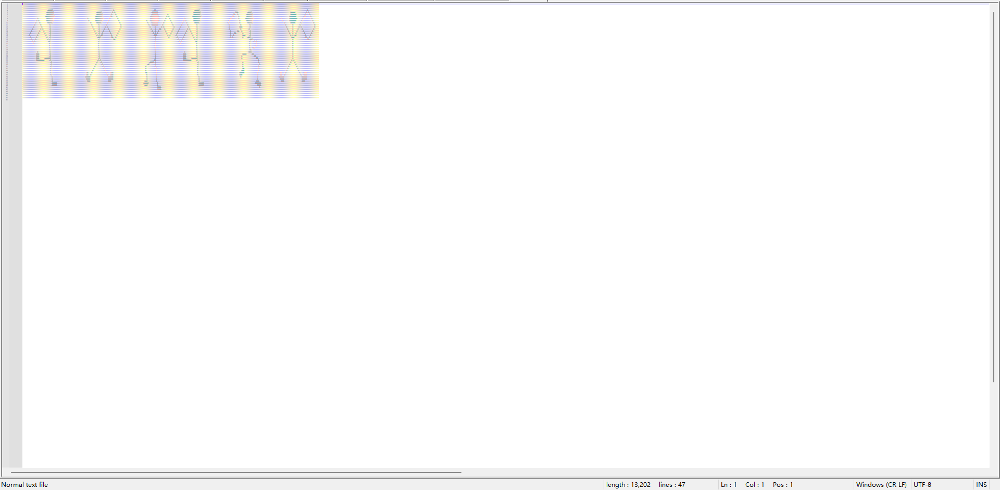

# ctfer2077③

## 题目简述

这是一条多载体隐藏链：先从 HTTP 流量中重组上传的 ZIP，再依次经过 GIF 分帧、MP3Stego、Brainfuck 和“跳舞的小人”密码。每一层的输出都是下一层的密码或编码提示，必须记录中间值，不能只保留最终 flag。

## 解题过程

在 Wireshark 中按协议分级可见数据主要集中在 HTTP。筛选 `http.request.method == POST` 并跟踪对应 TCP 流，关键请求头和 multipart 字段为：

```http
POST /upload HTTP/1.1
Host: 127.0.0.1:1145
Content-Type: multipart/form-data; boundary=f59c343b840d4d551eea03e18b571909
Content-Length: 3702984

Content-Disposition: form-data; name="file"; filename="secret.zip"
```

这说明主体中携带的是名为 `secret.zip` 的约 3.7 MB 压缩包。可在“文件 → 导出对象 → HTTP”中选择该 multipart 对象保存，也可以从跟踪流的请求体中按 ZIP 文件头导出。

第一层解压后有 GIF、MP3 和后续压缩包。逐帧导出 GIF，其中一帧直接给出第一段密码：

```text
C5EZFsC6
```


MP3 文件名含有 `brainfuck`，并且已有一段疑似口令，因此用 MP3Stego 的解码程序以 `C5EZFsC6` 为密码提取隐藏文本：

```bash
Decode.exe -X -P C5EZFsC6 brainfuck.mp3
```

终端会提示 `Will attempt to extract hidden information`，并把隐藏内容写入 `brainfuck.mp3.txt`。该文件是一段 Brainfuck 程序；下面已去掉不影响执行的空格：

```brainfuck
++++++++[->++++++++<]>++++++++.<++++[->----<]>---.<+++++++[->+++++++<]>+.<+++++[->-----<]>------.<+++[->+++<]>++++++.<+++[->---<]>-.<++++[->----<]>----.<++++++[->++++++<]>+++++.<
```

运行后输出第二段密码：

```text
H5gHWM9b
```

用第二段密码解开最后的压缩包，得到三个只含 `0`、`1` 的文本。用等宽字体缩小显示、把一种字符视为前景色后，会形成《福尔摩斯探案集》中的“跳舞的小人”符号。



按原著密码表解码；题目提示旗帜只作分隔符、不代表字母，并要求全大写、以下划线分词。最终得到：

```text
moectf{PEOPLE_DANCING_HAPPILY}
```

## 方法总结

多层杂项题的稳定方法是为每层记录“载体、识别信号、工具、输出”。本题依次为 `PCAP/HTTP POST → ZIP`、`GIF/帧差 → C5EZFsC6`、`MP3Stego → Brainfuck`、`Brainfuck → H5gHWM9b`、`01 点阵 → 跳舞的小人`。这样即使某个在线解码器失效，也能从正文恢复完整逻辑。
