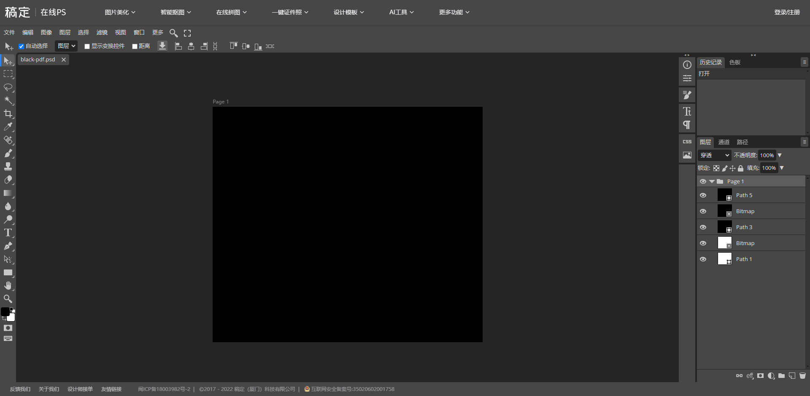

# 我的图层在你之上

## 题目简述

附件是一份视觉上近乎全黑的矢量 PDF。题目把工具入口附加在 PDF 尾部，并利用 PDF 可同时保存矢量路径和位图对象的特性，将两个有效图像藏在不同图层中；把这两层按像素相加后才能恢复压缩包密码。

## 解题过程

先用十六进制编辑器查看 `black.pdf` 尾部。在 `%%EOF` 之后可以看到附加的 ASCII URL：

```text
https://ps.gaoding.com/
```

将 PDF 导入能保留 PDF 对象层次的图像编辑器后，可见五层：`Path 1`、`Bitmap`、`Path 3`、`Bitmap`、`Path 5`。三个 `Path` 是生成矢量 PDF 时产生的路径层，两个 `Bitmap` 才是题目隐藏的有效载荷。



分别导出两个同尺寸 Bitmap，然后对每个颜色通道做饱和加法，即

$$
R(x,y)=\min\bigl(A(x,y)+B(x,y),255\bigr),
$$

或直接在图像编辑器中使用 Add/线性减淡（添加）混合模式，即可显出密码。用该密码解开压缩包后得到 `caesar.txt`，枚举 26 种凯撒位移即可恢复：

```text
moectf{d751894b-ee0a-47dd-85d4-e92d0443921f}
```

## 方法总结

PDF 隐写不能只看渲染结果。应同时检查文件尾、对象流、注释与图层结构；矢量 PDF 导入编辑器后出现多个独立对象，就是继续拆层的强信号。图层合成时还要区分普通透明度叠加与逐像素 Add，本题需要后者才能还原密码图案。
