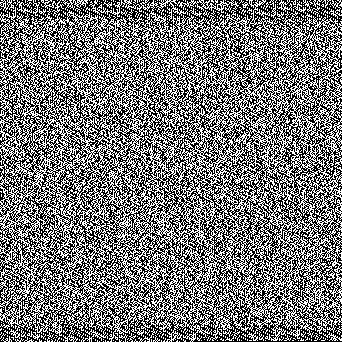

# Meaningful Noise

## 题目简述

附件是一张只含黑白像素的方形图片。它没有可见二维码定位块或其他常规图形结构，但图像末尾存在连续黑色区域，提示像素可能直接表示二进制位，尾部黑色像素则充当零填充。



黑色映射为 0、白色映射为 1，按行优先顺序重组字节后，得到 Base64 文本；再解码即可恢复一张含 flag 的 PNG。

## 解题过程

### 将像素还原为字节流

应先将图片显式转为二值模式，避免 RGB 元组、调色板索引或灰度值差异影响判断。像素顺序采用 Pillow 的行优先 `getdata()` 顺序：

```python
from pathlib import Path
import base64

from PIL import Image


image = Image.open("pxls.png").convert("1")
bits = "".join(
    "0" if pixel == 0 else "1"
    for pixel in image.getdata()
)

# 丢弃不足一个字节的尾部，并删除完整的零字节填充。
bits = bits[:len(bits) // 8 * 8]
while bits.endswith("00000000"):
    bits = bits[:-8]

encoded = bytes(
    int(bits[offset:offset + 8], 2)
    for offset in range(0, len(bits), 8)
)
print(encoded[:32])
```

输出开头为：

```text
iVBORw0KGgo
```

这是 PNG 文件经 Base64 编码后的典型前缀。原官方脚本在 `np.array(Image.open(...))` 处缺少右括号，并把完整位串先转换成巨大整数；上面的逐字节恢复既修正了语法错误，也避免了不必要的大整数转换。

### 解码内层 PNG

```python
recovered = base64.b64decode(encoded, validate=True)
assert recovered.startswith(b"\x89PNG\r\n\x1a\n")
Path("flag.png").write_bytes(recovered)
```

恢复出的图片只承载文字，没有额外视觉机制，因此不再作为 WP 图片重复保存，直接转写其中内容：

```text
N0PS{b1n4rY_4s_P1x3Lz}
```

## 方法总结

- 核心技巧：把黑白像素按行优先顺序映射为比特，去除零字节填充后依次完成字节重组和 Base64 解码。
- 识别信号：图片仅有两种像素值、视觉上近似噪声、尾部有规律的单色填充，恢复出的首层数据具有明确 Base64/PNG 魔数。
- 复用要点：应固定颜色映射、遍历顺序和位序，并在每层用格式特征验证结果。仅凭“看起来像 Base64”不足以确认，应同时检查解码后的 PNG 文件头。
