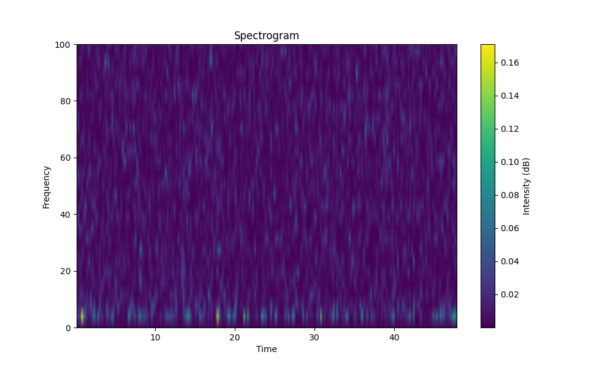
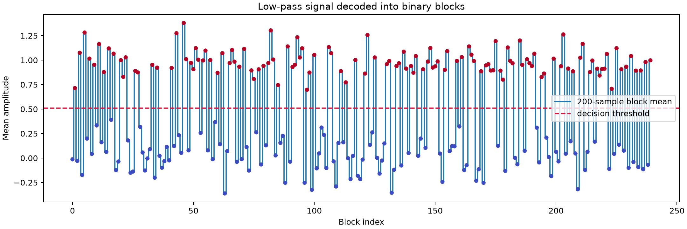

# Big Phone

## 题目简述

附件 `data.txt` 保存了一长串浮点采样值。时域波形看起来接近随机噪声，需要从其中找出被低频成分掩盖的二进制消息。

## 解题过程

先按题目使用的 $1000\ \text{Hz}$ 采样率绘制谱图。主要能量异常集中在 $20\ \text{Hz}$ 以下，而高频部分更像用于掩盖消息的噪声：



因此使用五阶 Butterworth 低通滤波器，截止频率设为 $20\ \text{Hz}$，并用 `filtfilt` 做前后向滤波以避免相位偏移。滤波后可以发现，信号每 200 个采样点保持在相对稳定的高、低电平；对每个 200 点窗口取均值，就能把噪声进一步压低。

以所有窗口均值的最大值与最小值中点作为判决阈值：

$$
T=\frac{\max(\bar{x})+\min(\bar{x})}{2}
$$

均值高于 $T$ 记为 1，否则记为 0。下图中红、蓝点已经清楚分成两组：



完整解码脚本如下：

```python
import numpy as np
from scipy.signal import butter, filtfilt

signal = np.loadtxt("data.txt")
sample_rate = 1000
cutoff = 20
block_size = 200

b, a = butter(
    5,
    cutoff / (sample_rate / 2),
    btype="low",
)
filtered = filtfilt(b, a, signal)

levels = np.array([
    filtered[offset:offset + block_size].mean()
    for offset in range(0, len(filtered), block_size)
])
threshold = (levels.max() + levels.min()) / 2
bits = (levels > threshold).astype(int)

usable = len(bits) - len(bits) % 8
plain = "".join(
    chr(int("".join(map(str, bits[i:i + 8])), 2))
    for i in range(0, usable, 8)
)
print(plain)
```

输出为：

```text
UUN0PS{Ju5t_h1Dd3n_1N_no153}UU
```

去掉首尾的填充字符 `UU` 后，flag 为：

```text
N0PS{Ju5t_h1Dd3n_1N_no153}
```

## 方法总结

这是一道以数值序列为载体的信号隐写题。先用频域分析确定消息所在频带，再低通滤波、按固定符号周期积分并阈值判决，就能把低信噪比的模拟波形还原成比特。若事先不知道每比特的采样数，可以枚举窗口长度，并用 `N0PS` 前缀和可打印字符比例筛选结果。
