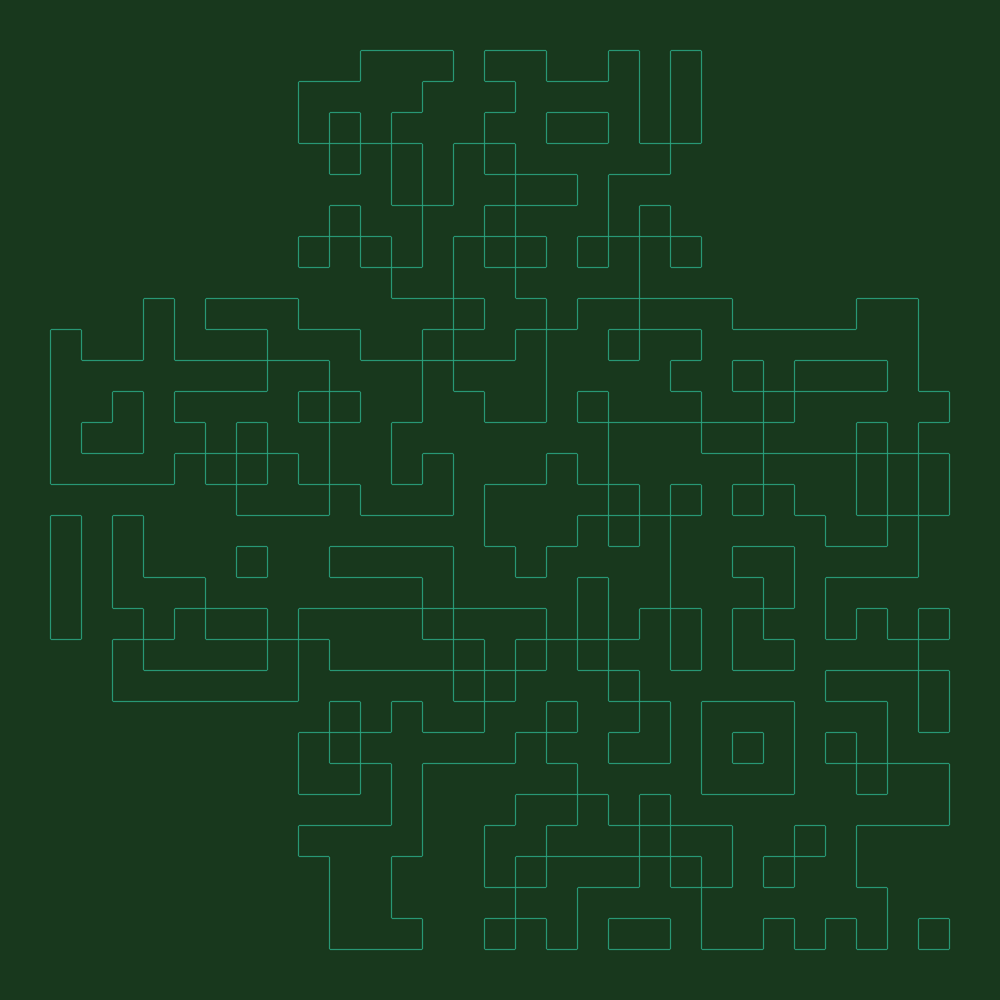

# Maze

## 题目简述

题目给出一张深绿色背景上的青色“迷宫”线稿。线条由大量直角和规则方格组成，实际是经过边缘化、改色并删除三个定位图案后的二维码，需要恢复填充区域和 QR 定位块。

## 解题过程

原图中的规则网格、右下角小方块以及整体近似正方形的布局都指向二维码。更直接地说，图中保留的是 QR 黑白模块边界，而不是模块本身：



先转为灰度图，再以最小、最大像素值的中点进行二值化。随后逐行扫描：每遇到一段新的边界就切换“填白”与“填黑”状态，从而把边缘图恢复为实心模块。整理后的脚本如下：

```python
from PIL import Image
import numpy as np

image = Image.open("maze.png").convert("L")
array = np.asarray(image)
threshold = (
    int(array.min()) + int(array.max())
) / 2
binary = image.point(
    lambda value: 255 if value > threshold else 0
)

pixels = binary.load()
width, height = binary.size

for y in range(height):
    encounters = 0
    white_run = 0

    for x in range(width):
        original = pixels[x, y]
        fill_white = encounters % 2 == 0

        if original != 0:
            white_run += 1
        else:
            if white_run > 0:
                encounters += 1
            white_run = 0

        pixels[x, y] = 255 if fill_white else 0

binary.save("almost-qr.png")
```

此时数据模块已经恢复，但题目制作时删除了二维码三个角上的定位图案。按照标准 QR 结构，在左上、右上和左下补上由“黑框、白框、黑色中心”组成的三个 finder pattern，并保留外围白色安静区，扫码器即可识别：


扫码结果为：

```text
N0PS{7hI5_1s_R3a1Ly_4_Qr_C0d3}
```

## 方法总结

本题把二维码的模块边界伪装成迷宫。识别阶段应关注规则网格、直角边和 QR 固有的角部结构；恢复阶段则相当于对每条扫描线做奇偶填充。即使数据区正确，缺少三个定位图案和安静区也会让扫码器失败，因此最后还必须补齐 QR 的结构性视觉标记。
