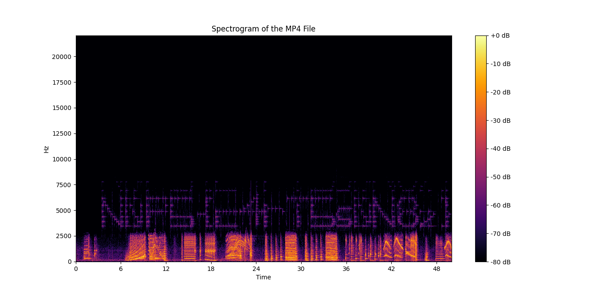

# Musical Encounter

## 题目简述

附件 `dancing_skeletons.mp4` 的正常音轨中混入了人耳不易察觉的高频、低强度信号。题目提示“看见并听见”以及“它们在说什么”，需要把音频转换到时频域寻找隐藏文字。

## 解题过程

直接播放视频时，隐藏内容被正常音频掩盖。对音轨做短时傅里叶变换后，每个时间窗口的频率能量会映射成谱图像素；制作者正是用若干窄带音调在谱图上绘制字符。

隐藏信息位于视频约 85 至 135 秒、约 3 kHz 至 8 kHz 的区域。下面的脚本保留原始采样率，截取该区间并绘制对数幅度谱：

```python
import librosa
import librosa.display
import matplotlib.pyplot as plt
import numpy as np

audio, sample_rate = librosa.load(
    "dancing_skeletons.mp4",
    sr=None,
)

start = int(85 * sample_rate)
end = int(135 * sample_rate)
segment = audio[start:end]

spectrum = np.abs(librosa.stft(segment))
spectrum_db = librosa.amplitude_to_db(
    spectrum,
    ref=np.max,
)

plt.figure(figsize=(12, 7))
librosa.display.specshow(
    spectrum_db,
    sr=sample_rate,
    x_axis="time",
    y_axis="hz",
    cmap="inferno",
)
plt.ylim(0, 10000)
plt.colorbar(format="%+2.0f dB")
plt.tight_layout()
plt.show()
```

在对数色标下，低能量高频分量组成的文字清晰可见，并在片段中重复出现：



读取得到：

```text
N0PS{c4rT5s0N8z}
```

## 方法总结

频谱隐写把“时间”作为横轴、“频率”作为纵轴，用不同频率音调绘制二维字符。遇到听感正常但题面强调声音、看见或高低频的媒体题，应检查完整音轨的谱图，并调整时间区间、频率上限和动态范围。这里真正暴露文字的是低于主音轨很多的能量，因此使用 dB 标度比线性幅值更容易观察。
