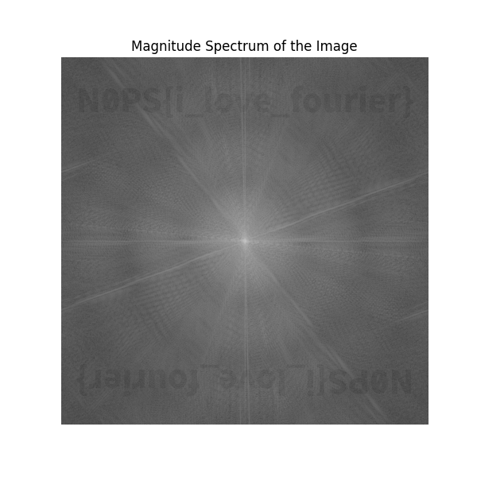

# The Great Mugman

## 题目简述

题目给出一张 Noopsy 的自拍，并提示“边缘画质较差”“朋友 Joseph”“1807”。这些线索指向 Joseph Fourier 及傅里叶变换，需要查看图像的频域幅度谱。


## 解题过程

普通图像展示的是空间域像素，而周期纹理、方向性边缘和人为嵌入的频率分量在二维傅里叶域中更明显。先把图片转成灰度数组，计算二维快速傅里叶变换，再用 `fftshift` 把零频移到图像中心。

频谱幅值跨度很大，直接显示会被中心低频亮点淹没，因此使用：

$$
M(u,v)=\log\left(1+\left|F(u,v)\right|\right)
$$

压缩动态范围：

```python
from PIL import Image
import matplotlib.pyplot as plt
import numpy as np

image = Image.open("noopsy_selfie.png").convert("L")
spatial = np.asarray(image, dtype=float)

frequency = np.fft.fft2(spatial)
centered = np.fft.fftshift(frequency)
magnitude = np.log1p(np.abs(centered))

plt.figure(figsize=(8, 8))
plt.imshow(magnitude, cmap="gray")
plt.axis("off")
plt.tight_layout()
plt.show()
```

幅度谱的上半部分出现了隐藏文字；下半部分还有一份中心对称的副本，这是实值图像傅里叶变换具有共轭对称性的正常结果：



读取上方文字得到：

```text
N0PS{i_love_fourier}
```

## 方法总结

题面中的姓名和年份提供了方法线索，而“边缘”暗示高频信息。二维 FFT、频谱中心化和对数幅度显示是检查图像频域隐写的基本流程。频谱中成对出现的文字不是两个不同载荷，而是实值输入的共轭对称性质所致。
