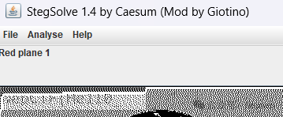

# NepCTF2026 CatFlagExpert Writeup

## 题目简述

附件是一段经过精心构造的 Sixel 图像。flag 被拆成四部分，分别藏在可见图像、被后续像素覆盖的旧画面、超长重复指令和未使用调色板条目中。仅把最终画面转成 PNG 只能得到第一部分。

## 解题过程

Sixel 先定义最多 256 色的调色板，再用字符编码每列 6 个纵向像素。控制符 `$` 会回到当前图像行起点并允许覆盖，`-` 则进入下一条 Sixel 行；`!<n><char>` 表示把某个绘图字符重复 $n$ 次。

### 第一部分：正常渲染

用 Sixel 终端或转换器渲染，左上角可见：



```text
NepCTF{Hell0_
```

### 第二部分：恢复被覆盖像素

编写最小解析器时，不要只保存每个坐标的最终颜色，还要记录同一像素被赋值的历史。把被第二次绘制覆盖的旧像素单独输出，可重组成二维码：


二维码内容是一段 Malbolge 程序。使用标准 Malbolge 解释器执行后输出：

```text
Sixel_Steg_You
```

Malbolge 程序本身只是文本载荷，归档时应转写或由解析器提取，不需要保留代码截图。

### 第三部分：异常重复长度

展开 `!<n><char>` 时会发现图像宽度异常增至 9930。检查重复数字附近的原始字节，可提取：

```text
_H4ve_RRREa
```

这里不应真的分配一张 9930 像素宽的图片；直接解析重复计数及其周边文本更稳妥。

### 第四部分：未使用调色板

统计最终像素引用的颜色编号后，发现调色板 253、254、255 从未用于绘图。读取这些条目的原始定义可得到：

```text
vled_17!}
```

依序拼接四部分：

```text
NepCTF{Hell0_Sixel_Steg_You_H4ve_RRREavled_17!}
```

## 方法总结

Sixel 不只是“终端里的一张图”，还是带状态和覆盖语义的绘图语言。分析时应同时保留最终画布、像素写入历史、压缩指令和调色板原始定义。只调用现成转换器会丢失第二至第四层信息；而记录每次绘制事件的轻量解析器可以完整覆盖这些隐写面。
