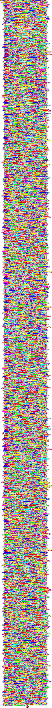
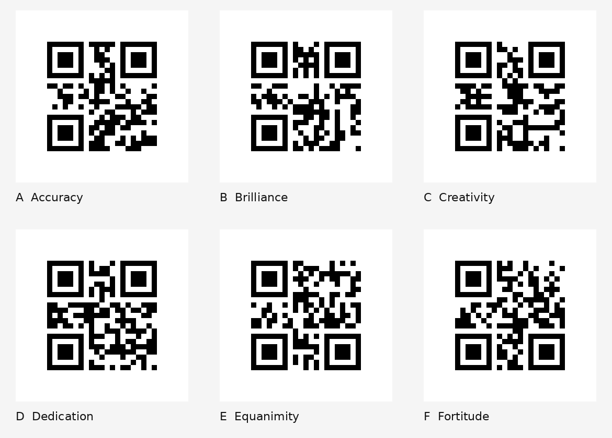

# Time Capsule

## 题目简述

题目给出一份离线“数字考古”材料，主要包含两段文本日志、一份 PCAP、两段 WAV、约一百个以科幻电影命名的加密 ZIP、`Secret.png` 和体素查看器 `VoxelEditor.html`。最终目标不是从单个文件中直接搜索 flag，而是依次完成图像程序识别、零宽字符解码、加密压缩包筛选、二进制分片重组、三维 Hilbert 曲线还原和二维码识别。

决定性障碍是隐藏载荷的跨载体重组，因此归入 Stego。题目同时涉及取证式盘点，但 PCAP、音频和日志在这里主要承担隐藏线索与筛选提示的作用。

## 解题过程

### 1. 盘点文件并识别第一把钥匙

先列出附件：

```text
attachment/
├── COMPRESSED_DATA/          # 约 100 个加密 ZIP
├── RECORD/
│   ├── Dramamine.wav
│   └── Sirius's Heart - symphony.wav
├── satellitelog/
│   ├── Satellite_log--2A7E.4.001.txt
│   ├── Satellite_log--2A7E.4.002.txt
│   └── Satellite_log--2A7E.4.003.pcap
├── Secret.png
└── VoxelEditor.html
```

`Secret.png` 只有 $78\times1054$ 像素，内容由有限颜色的规则色块组成，不像照片或普通位平面隐写。它实际上是 Piet 图像程序：



本地 `npiet` 只接受 PPM 时，可以先转换格式：

```bash
magick Secret.png Secret.ppm
npiet Secret.ppm
```

程序输出一串十进制 ASCII 码。转成字符后得到：

```text
Thx 2 Piet Mondrian ... the key you found is P137_M0dri4n
```

因此 `SECRET.zip` 的密码是：

```text
P137_M0dri4n
```

解压后得到空文件 `what you find is hidding in other movies.txt` 和大小为 1024 字节的 `part_1.bin`。文件名明确提示其余分片藏在电影压缩包中。

### 2. 解出零宽字符线索

第一段日志末尾主动给出若干 Unicode 码位：

```text
200A|200E|200B|2063|200F|FEFF
```

第二段日志肉眼看似只是 leetspeak 文本，但其中夹有零宽字符。真正有意义的片段均由 16 个 `U+200E/U+200F` 组成：前 8 位是同步前缀，后 8 位才是一个字符；取 `U+200E=0`、`U+200F=1`。大量 `U+200B` 是噪声，不应混入位流。

```python
from pathlib import Path
import re

text = Path("Satellite_log--2A7E.4.002.txt").read_text(encoding="utf-8")
runs = re.findall(r"[\u200e\u200f]{16}", text)

message = "".join(
    chr(
        int(
            "".join("0" if ch == "\u200e" else "1" for ch in run[8:]),
            2,
        )
    )
    for run in runs
)
print(message)
```

输出为：

```text
I have the high ground
```

这是《Star Wars》中非常明确的台词线索，对应 `Star Wars.zip`。

### 3. 从 ZIP 结构中筛出另外两部电影

只凭一百多个文件名猜电影并不可靠。逐个读取 ZIP 中央目录后可以发现一个可复现的结构差异：

- 绝大多数干扰包的通用标志位为 `0x1`，只使用传统 ZipCrypto；
- `SECRET.zip`、`2001 - A Space Odyssey.zip`、`The Matrix.zip` 和 `Star Wars.zip` 的标志位为 `0x9`，额外字段还包含 WinZip AES 标识 `0x9901`；
- 除 `SECRET.zip` 外，后三个恰好分别保存 `part_2.bin`、`part_3.bin`、`part_4.bin`。

可以只用中央目录进行无密码筛选：

```python
from pathlib import Path
from zipfile import ZipFile

for path in Path("COMPRESSED_DATA").glob("*.zip"):
    with ZipFile(path) as zf:
        infos = zf.infolist()
        uses_aes = any(b"\x01\x99" in item.extra for item in infos)
        if uses_aes:
            print(path.name, [item.filename for item in infos])
```

本地输出为：

```text
2001 - A Space Odyssey.zip ['part_2.bin']
SECRET.zip                 ['what you find is hidding in other movies.txt', 'part_1.bin']
Star Wars.zip              ['part_4.bin']
The Matrix.zip             ['part_3.bin']
```

这一步同时校验了音频、日志和电影主题给出的线索，避免对所有 ZIP 进行无意义爆破。

第二段日志正文还写有 `UM4-42`，整篇又统一使用 `7h3`、`4ll` 一类 leetspeak。把著名的 “Forty Two” 按同样规则改写，可得到三个电影包共用的密码：

```text
F0r7y_7w0
```

该密码已在本地分别通过三个 AES ZIP 的完整性测试，不是根据文件名臆测出来的结果。公开题解通常只写“音频与数据包线索导向该密码”，却没有给出可复现的中间解码过程；这里以日志中的 `42`、统一的 leetspeak 规则和 ZIP 实测作为证据，不补写无法验证的细节。

三份分片的对应关系为：

| 压缩包 | 解出文件 | 大小 |
| --- | --- | ---: |
| `2001 - A Space Odyssey.zip` | `part_2.bin` | 1024 字节 |
| `The Matrix.zip` | `part_3.bin` | 1024 字节 |
| `Star Wars.zip` | `part_4.bin` | 1024 字节 |

### 4. 重组 4096 字节位流

按编号连接四个文件：

```bash
cat part_1.bin part_2.bin part_3.bin part_4.bin > capsule.bin
```

总长度为：

$$
4\times1024=4096\ \text{bytes}
$$

换算成位数：

$$
4096\times8=32768=32^3=2^{15}
$$

这与三维、五阶 Hilbert 曲线完全吻合：维数 $n=3$，阶数 $p=5$，每个坐标轴长度为 $2^5=32$，共有 $2^{3\times5}=32768$ 个坐标。

读取位流时必须使用每字节高位在前的顺序。对第 $i$ 个 bit 计算 Hilbert 坐标 $(x_i,y_i,z_i)$，再把 bit 作为颜色写入体素。下面是本题使用的核心映射：

```python
def hilbert_point(index: int, order: int = 5, dims: int = 3) -> list[int]:
    bits = f"{index:0{order * dims}b}"
    point = [int(bits[i::dims], 2) for i in range(dims)]

    # Gray decode
    t = point[-1] >> 1
    for i in range(dims - 1, 0, -1):
        point[i] ^= point[i - 1]
    point[0] ^= t

    # Undo excess work
    q = 2
    while q != (2 << (order - 1)):
        mask = q - 1
        for i in range(dims - 1, -1, -1):
            if point[i] & q:
                point[0] ^= mask
            else:
                t = (point[0] ^ point[i]) & mask
                point[0] ^= t
                point[i] ^= t
        q <<= 1

    return point
```

`VoxelEditor.html` 接收的格式是：

```json
[
  [0, 0, 0, 1],
  [0, 0, 1, 0]
]
```

每项依次为 `[x, y, z, color]`，其中 `1` 渲染为黑色，`0` 渲染为白色。

### 5. 提取六个二维码平面

恢复后的数据并不是把二维码放在 $31$ 坐标的外表面。实际可读平面位于：

```text
x = 0,  x = 24
y = 0,  y = 24
z = 0,  z = 24
```

每个二维码占 $25\times25$ 个模块。直接查看整个 $32\times32$ 切片会把坐标 25 至 31 的附加数据也带入图像，容易误以为后三个面是噪声；裁出前 $25\times25$ 模块并补白色静区后即可稳定识别。



六个结果按题目要求的 A 至 F 顺序排列：

```text
A = Accuracy
B = Brilliance
C = Creativity
D = Dedication
E = Equanimity
F = Fortitude
```

最终 flag 为：

```text
R3CTF{Accuracy_Brilliance_Creativity_Dedication_Equanimity_Fortitude}
```

## 方法总结

本题的关键不是对单个附件套用隐写工具，而是建立完整、可验证的证据链：

1. 把规则色块图识别为 Piet 程序，执行后获得 `SECRET.zip` 密码；
2. 严格区分零宽字符同步前缀、有效位和噪声，解出 Star Wars 台词；
3. 利用 ZIP 中央目录的 AES 标识筛出三份真实电影分片，避免爆破全部干扰包；
4. 用 `UM4-42`、全文 leetspeak 风格和压缩包实测确认公共密码 `F0r7y_7w0`；
5. 从 $4096\times8=32^3$ 推断三维五阶 Hilbert 映射；
6. 在坐标 0 与 24 的六个 $25\times25$ 平面提取二维码，按 A 至 F 组装 flag。

题目最容易出现的错误有三类：把 `U+200B` 噪声并入零宽位流、按普通线性顺序摆放 32768 个 bit，以及只检查坐标 0/31 的外表面。每一步都应以文件大小、ZIP 元数据、二维码可解码性和最终 flag 结构进行交叉验证。
