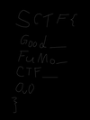

# FUMO_xor_cli

## 题目简述

连接服务后会看到用 ANSI 真彩色转义序列绘制的命令行动画，输出中还给出一张赛前宣传图。两类载体各自都只呈现正常图像：终端动画中藏有两帧异常的 $133\times50$ 像素图，宣传图则把数据分散在 $9\times9$ 网格的固定采样点中。把两帧重组为密钥图，再与宣传图提取结果逐像素异或，才会出现手写 flag。

这道题的决定性步骤是发现并恢复空间隐藏通道，因此归入 Stego；像素异或只是提取链最后的可逆运算。

## 解题过程

### 从 ANSI 输出恢复帧

先原样保存网络输出，避免终端渲染丢掉转义序列：

```bash
nc challenge-host 2333 > terminal-animation.bin
```

每帧结束时会连续上移 51 行，因此可用 `b"\x1b[A" * 51` 分帧。颜色使用 `ESC[38;2;r;g;bm`，按行优先还原成 $133\times50$ 的 RGB 图：

```python
import re
from pathlib import Path
from PIL import Image

raw = Path("terminal-animation.bin").read_bytes()
frames = raw.split(b"\x1b[A" * 51)[1:]

decoded = []
for frame in frames:
    colors = re.findall(rb"\[38;2;(\d+);(\d+);(\d+)m", frame)
    if len(colors) != 133 * 50:
        continue
    image = Image.new("RGB", (133, 50))
    image.putdata([tuple(map(int, rgb)) for rgb in colors])
    decoded.append(image)
```

绝大多数帧属于循环动画，只有第 20、22 帧在像素层面明显不同。不能只比较文件大小，因为 PNG 压缩会放大无关差异；应比较还原后的 RGB 数组或直接计算帧差。

### 从宣传图提取另一张数据图

宣传图由 $9\times9$ 小格组成，每格坐标偏移 `(1, 1)` 的像素承载有效颜色。按列、再按行采样后得到 $100\times133$ 的 `data`：

```python
from PIL import Image

cover = Image.open("a3.png").convert("RGBA")
data = Image.new("RGB", (100, 133))

for x, left in enumerate(range(0, cover.width - 8, 9)):
    for y, top in enumerate(range(0, cover.height - 8, 9)):
        data.putpixel((x, y), cover.getpixel((left + 1, top + 1))[:3])
```

两张异常帧先上下拼成 $133\times100$，再尝试交换上下顺序、旋转 90/270 度及水平/垂直翻转。这样得到的 12 个候选密钥均为 $100\times133$，与 `data` 尺寸一致。对每个候选做 RGB 分量异或：

```python
def xor_images(left, right):
    assert left.size == right.size
    out = Image.new("RGB", left.size)
    out.putdata([
        tuple(a ^ b for a, b in zip(p, q))
        for p, q in zip(left.getdata(), right.getdata())
    ])
    return out
```

正确方向的结果出现可辨认的手写字符：



把各行连接后得到：

```text
SCTF{Good__FuMo__CTF__OwO}
```

## 方法总结

本题把密钥与数据分别藏在时间序列和规则网格中。稳定流程是：保存原始 ANSI 字节流、按光标控制序列分帧、解析真彩色像素、用帧差找异常帧、按网格固定点采样宣传图，最后穷举有限的拼接方向并逐像素异或。归档只保留异或结果这一张无法由纯文本完全替代的视觉证据；终端代码、宣传图和噪声中间图的作用均已在正文说明，不再用冗余截图代替步骤。
